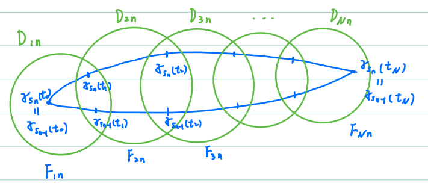

#! https://zhuanlan.zhihu.com/p/655388300

- [复分析Complex Analysis笔记整理 Part1](#复分析complex-analysis笔记整理-part1)
  - [1.2a Holomorphic](#12a-holomorphic)
    - [Wirtinger derivatives](#wirtinger-derivatives)
  - [1.2b Analytic](#12b-analytic)
  - [1.6 Complex integration](#16-complex-integration)
  - [1.7a Applications - holomorphic is analytic](#17a-applications---holomorphic-is-analytic)

# 复分析Complex Analysis笔记整理 Part1

## 1.2a Holomorphic

$\Omega\subset\mathbb{C}$ domain (i.e. connected open set), $f:\Omega\to\mathbb{C}$ function. Regard $f$ as a map from $\Omega\subset\mathbb{R^2}$ to $\mathbb{R^2}$, write $f(x,y)=(u(x,y),v(x,y))$. Recall $f=(u,v)$ is real differentiable at $z_0=(x_0,y_0)$ if $u$ and $v$ are real differentiable at $z_0=(x_0,y_0)$. Which means $u_x,u_y,v_x,v_y$ all exist at $z_0$ and
$$
u(x,y)=u(x_0,y_0)+u_x(x_0,y_0)\Delta x+u_y(x_0,y_0)\Delta y+o(\sqrt{\Delta x^2+\Delta y^2})\\
v(x,y)=v(x_0,y_0)+v_x(x_0,y_0)\Delta x+v_y(x_0,y_0)\Delta y+o(\sqrt{\Delta x^2+\Delta y^2})
$$

$\bf Thm\ (Cauchy-Riemann\ equations)$

$f$ is complex differentiable at $z_0$ $\Leftrightarrow$ at $z_0$, $\begin{cases}u_x=v_y\\ u_y=-u_x\end{cases}$.

$\bf Def\ (Holomorphic)$

1. We say $f$ is holomorphic at $z_0\in\Omega$ if $f$ is complex differentiable nearby $z_0$ (nearby means in some open neighborhood;
2. We say $f$ is holomorphic on $\Omega$ if $f$ is holomorphic at every point in $\Omega$.

  

### Wirtinger derivatives

We define the operators $\frac{\partial}{\partial z}$ and $\frac{\partial}{\partial\bar z}$ by the chain rule:
$$
\frac{\partial}{\partial z}=\frac{1}{2}\frac{\partial}{\partial x}-\frac{i}{2}\frac{\partial}{\partial y}\\[1ex]
\frac{\partial}{\partial\bar z}=\frac{1}{2}\frac{\partial}{\partial x}+\frac{i}{2}\frac{\partial}{\partial y}
$$
They are called the Wirtinger derivatives. It turns out that the Wirtinger derivatives naturally fit into the CR equations: $\begin{cases}u_x=v_y\\ u_y=-u_x\end{cases}\Leftrightarrow\dfrac{\partial f}{\partial\bar z}=0$

---

## 1.2b Analytic

$\bf Def\ (Analytic)$

1. We say $f$ is analytic at $z_0\in\Omega$ if $\exists r>0$ s.t. $f(z)=\sum_{n=0}^\infty a_n(z-z_n)^n$ on $D(z_0,r)$, where $\sum_{n=0}^\infty a_n(z-z_n)^n$ is some convergent power series on $D(z_0,r)$.
2. We say $f$ is analytic on $\Omega$ if $f$ is analytic at every point in $\Omega$.

$\bf Notation$

1. $\mathcal{H}(\Omega)=\{\text{all holomorphic functions on }\Omega\}$;
2. $\mathcal{A}(\Omega)=\{\text{all analytic functions on }\Omega\}$;
3. $C^k(\Omega)=\{f=u+iv:u,v\in C^k\}$;
4. $C^\infty(\Omega)=\{f=u+iv:u,v\in C^\infty\}$

$\bf Prop$ $(\mathcal{A\subset H})$

Suppose $f(z)=\sum_{n=0}^\infty a_n(z-z_n)^n$ on $D(z_0,r)$, then $f$ is complex differentiable on $D(z_0,r)$ and $f'(z)=\sum_{n=0}^\infty na_n(z-z_n)^{n-1}$ on $D(z_0,r)$. Thus

1. $\mathcal{A\subset H}$;
2. $\mathcal{A}\subset C^\infty\subset C^k$;

---

## 1.6 Complex integration

$\bf Def\ (Complex\ integration)$

For any (piecewise) $C^1$ curve $\gamma:[0,1]\to\Omega$ and any $f\in C(\Omega)$, we define the complex integration
$$
\int_\gamma f(z)dz=\int_0^1f(\gamma(t))\gamma'(t)dt
$$

$\bf Prop\ (ML\ inequality)$
$$
\left|\int_\gamma f(z)dz\right|\leq\max_{0\leq t\leq 1}|f(\gamma(t))|\cdot L(\gamma)
$$
where $L(\gamma)=\int_0^1|\gamma'(t)|dt$ is the length of $\gamma$.

  

$\bf Prop$

If $f\in\mathcal{H}(\Omega)\cap C^1(\Omega)$, then $\int_\gamma f'(z)dz=f(\gamma(1))-f(\gamma(0))$. In particular $\int_\gamma f'(z)dz=0$ for any closed curve $\gamma$ in $\Omega$. It's independent of the path and only depends on the starting point and the ending point.

$\bf Q$

For general $f\in\mathcal{H}(\Omega)$, $\int_\gamma f(z)dz$ may depend on the path. To what extent does $\int_\gamma f(z)dz$ depend on $\gamma$?

  

$\bf Def\ (Homotopy)$

1. Let $\gamma_0,\gamma_1$ be piecewise $C^1$ curves with the same starting points and the ending points. We say $\gamma_0\sim\gamma_1$ are homotopic in $\Omega$, if $\exists$ continuous map $H:[0,1]^2\to\Omega$, s.t.
   1. $\forall s\in[0,1]$, $\gamma_s(t)=H(t,s)$ is a piecewise $C^1$ curves with the same starting points and the ending points;
   2. $H(t,i)=\gamma_i(t)$ for $i=0,1$.
2. Let $\gamma_0,\gamma_1$ be piecewise $C^1$ closed curves. We say $\gamma_0\sim\gamma_1$ are homotopic in $\Omega$, if $\exists$ continuous map $H:[0,1]^2\to\Omega$, s.t.
   1. $\forall s\in[0,1]$, $\gamma_s(t)=H(t,s)$ is a piecewise $C^1$ closed curves;
   2. $H(t,i)=\gamma_i(t)$ for $i=0,1$.

  

$\bf Lem\ (Lebesgue\ number\ lemma)$

Suppose $(X,d)$ is a compact metric space and $\{U_\alpha\}$ is an open cover of $X$, then $\exists\delta>0$ s.t. $\forall S\subset X$, $\mathrm{diam}S<\delta\Rightarrow S\subset U_\alpha$ for some $\alpha$.

$\bf Thm\ (Cauchy's\ integral\ theorem)$

Let $\gamma_0,\gamma_1$ be piecewise $C^1$ curves. If $f\in C^1(\Omega)\cap\mathcal{H}(\Omega)$ and $\gamma_0\sim\gamma_1$ in one of the cases in the definition, then
$$
\int_{\gamma_0}f(z)dz=\int_{\gamma_1}f(z)dz
$$
I.e. $\int_{[\gamma]}f(z)dz:=\int_\gamma f(z)dz=$ is a homotopy invariant.

> $\it Sketch\ of\ Proof$
>
> (Step1) When $\Omega$ is a disk, first use Green's formula to show $\int_{\partial T}f(w)dw=0$ for any solid triangle $T\subset\Omega$. Then one can show $F(z)=\int_{\overline{z_0z}}f(w)dw$ is differentiable and is an anti-derivative of $f$ on $\Omega$, where $\overline{z_0z}$ is the line segment from $z_0$ to $z$.
>
> (Step2) Triangulate the homotopy into small cells, and use Lebesgue number lemma to show each cell is contained in some disk in $\Omega$.
>
> To be precise, $\forall z\in\Omega$, $\exists r_z>0$ s.t. $D_z:=D(z,r_z)\subset\Omega$. Suppose $H:[0,1]\times[0,1]\to\mathbb{C}$ is a homotopy between $\gamma_0$ and $\gamma_1$. Set $\gamma_s=H(\cdot,s)$. Then $\{D_z:z\in\mathrm{Im}(H)\}$ is an open cover of $\mathrm{Im}(H)$, thus $\{H^{-1}(D_z):z\in\mathrm{Im}(H)\}$ is an open cover of $[0,1]\times[0,1]$.
>
> Since $[0,1]\times[0,1]$ is compact, $[0,1]\times[0,1]\subset\bigcup_{j=1}^MH^{-1}(D_{z_j})$. By Lebesgue number lemma, let $\delta$ be the Lebesgue number of this finite cover.
>
> Take an even partition of the square $[0,1]\times[0,1]$:
> $$
0=t_0<t_1<\dots<t_N=1\\
0=s_0<s_1<\dots<s_N=1
> $$
> such that the diameter of each sub-rectangle is less than $\delta$. Denote $R_{mn}=[t_{m-1},t_m]\times[s_{n-1},s_n]$, then $R_{mn}\subset D_{mn}:=H^{-1}(D_{z_j})$ for some $1\leq j\leq M$. 
>
> Use the result of Step1 to go further. One can show $\int_{\gamma_s}f(z)dz$ is constant for $s\in[s_{n-1},s_n]$. What we want then follows.

  

$\bf Thm\ (Cauchy's\ integral\ formula)$

Let $\overline{D(z_0,r)}\subset\Omega$ and $f\in C^1(\Omega)\cap\mathcal{H}(\Omega)$, then $\forall z\in D(z_0,r)$
$$
f(z)=\frac{1}{2\pi i}\int_{\partial D(z_0,r)}\frac{f(\xi)}{\xi-z}d\xi
$$

---

## 1.7a Applications - holomorphic is analytic

$\bf Cor$

Let $\Omega$ be a simply connected domain, then every $f\in C^1(\Omega)\cap\mathcal{H}(\Omega)$ has an anti-derivative on $\Omega$.

$\bf Cor$ $(C^1\cap\mathcal{H}=\mathcal{A})$

Let $f\in C^1(\Omega)\cap\mathcal{H}(\Omega)$, $z_0\in\Omega$ and $r=d(z_0,\partial\Omega)$, then $\forall z\in D(z_0,r)$
$$
f(z)=\sum_{j=0}^\infty a_j(z-z_0)^j
$$
where
$$
a_j=\frac{1}{2\pi i}\int_{\partial D(z_0,r_1)}\frac{f(\xi)}{(\xi-z_0)^{j+1}}d\xi=\frac{f^{(j)}(z_0)}{j!}
$$
Thus $C^1\cap\mathcal{H}=\mathcal{A}$. Note that we have shown that $\mathcal{A}\subset C^1\cap\mathcal{H}$ in Sec 1.6, it yields $C^1\cap\mathcal{H}=\mathcal{A}$.

  

$\bf Thm\ (Morera's\ theorem)$

Let $f\in C(\Omega)$ and suppose $\mathcal{T}$ is a collection of solid triangles in $\Omega$
which contains all sufficiently small solid triangles in $\Omega$. If $\forall T\in\mathcal{T}$, $\int_{\partial T}f(z)dz=0$, then $f\in\mathcal{A}(\Omega)$.

$\bf Thm\ (Goursat's\ theorem)$

Suppose $f\in\mathcal{H}(\Omega)$, then for any solid triangle $T\subset\Omega$, we have $\int_{\partial T}f(z)dz=0$, thus $f\in\mathcal{A}(\Omega)$. Thus we have proved $\mathcal{A=H}$.

> $\it Idea$
>
> Divide and conquer.

  

$\bf Rmk$

Let $\Omega\subset\mathbb{C}$ be a domain, $f\in C(\Omega)$, then the following statements are equivalent:

1. $f\in\mathcal{H}(\Omega)$;
2. $f\in\mathcal{A}(\Omega)$;
3. $f$ is real differentiable and CR equations hold on $\Omega$;
4. $f$ is real differentiable and $\frac{\partial f}{\partial\bar z}=0$ on $\Omega$;
5. For any solid triangle $T\subset\Omega$, we have $\int_{\partial T}f(z)dz=0$;

---