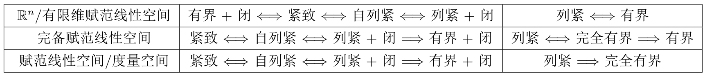
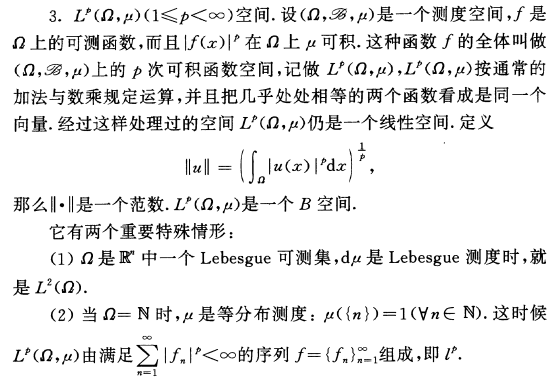
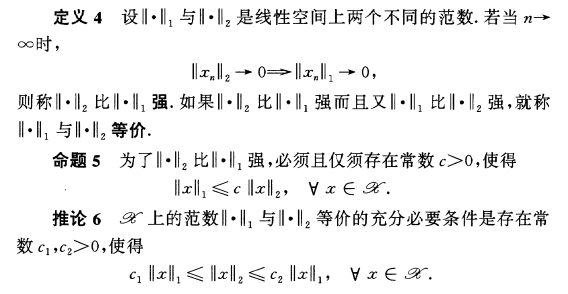
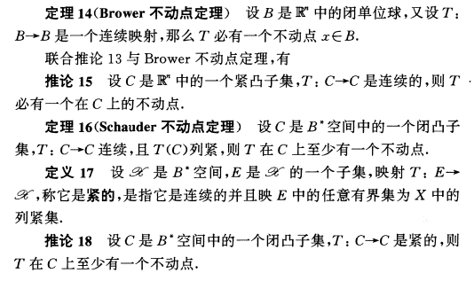

# 泛函分析Functional analysis笔记整理 第一章 度量空间

## §1 压缩映像原理

度量 $\rho(x,y)$ 是指

1. 正定性 $\rho(x,y)\geq 0$ 取等当且仅当 $x=y$；
2. 对称性 $\rho(x,y)=\rho(y,x)$；
3. 三角不等式 $\rho(x,y)\leq \rho(x,z)+\rho(z,y)$。

度量空间是拓扑空间，自然有各种拓扑概念。

$\bf E.g.$

1. $\mathbb{R^n}$ 赋予欧氏距离 $\sqrt{\sum(x_i-y_i)^2}$ 是度量空间。
2. 闭区间上全体连续函数 $C[a,b]$ 赋予上确界距离是度量空间。

$\bf Thm\ (Banach不动点定理，压缩映像原理)$

设 $T$ 是完备度量空间 $(X,\rho)$ 到自身的压缩映射，即存在 $\alpha\in(0,1)$ 使得 $\rho(Tx,Ty)\leq\alpha\rho(x,y)$，则 $T$ 有唯一不动点。

  

### ODE初值问题

设 $F(t,x)$ 在 $[-h,h]\times[\xi-\delta,\xi+\delta]$ 连续，且 $\exists L>0$ 使得当 $|F(t,x_1)-F(t,x_2)|\leq L|x_1-x_2|$。则当 $a<\min\{\frac{\delta}{M},\frac{1}{L}\}$ 时，初值问题
$$
\begin{cases}
x'(t)=F(t,x(t))\\
x(0)=\xi\in\mathbb{R}
\end{cases}
$$
在 $[-a,a]$ 上存在唯一解。

### 隐函数存在定理

设 $U\times V\subset\mathbb{R^n\times R^m}$ 是 $(x_0,y_0)\in\mathbb{R^n\times R^m}$ 的邻域，函数
$$
f(x,y)=(f_1(x,y),\dots,f_m(x,y)):\mathbb{R^n\times R^m\to R^m}
$$
和它关于 $y$ 的Jacobi矩阵
$$
\frac{\partial f(x,y)}{\partial y}:=\left(\frac{\partial f_i}{\partial y_j}(x,y)\right)_{m\times m}
$$
在上面连续。若 $f(x_0,y_0)=0$ 并且 $\det\left(\dfrac{\partial f(x,y)}{\partial y}\right)(x_0,y_0)\neq 0$，则存在 $(x_0,y_0)$ 的邻域 $U_0\times V_0\subset U\times V$ 以及唯一的连续函数 $\varphi:U_0\to V_0$ 满足 $\begin{cases}\forall x\in U_0,f(x,\varphi(x))=0\\\varphi(x_0)=y_0\end{cases}$

---

## §2 完备化

两个度量空间之间保持距离的满射（自然也是单射），称为等距同构。等距同构的空间一般不区分。若保持距离但不满，即前者与后者的一个子空间等距同构，称前者嵌入后者，后者包含前者，视为子空间。包含度量空间 $(X,\rho)$ 的最小的完备度量空间称为 $X$ 的完备化。

$\bf Prop$

若度量空间 $(X,\rho)$ 嵌入完备度量空间 $(\tilde X,\tilde \rho)$，且 $X$ 在 $\tilde X$ 中稠密，则 $\tilde X$ 是 $X$ 的完备化。

$\bf Prop$

度量空间总有完备化。

  

本章习题有个常用结论：度量空间上基本列收敛当且仅当存在收敛子列。

---

## §3 列紧集

度量空间 $(X,\rho)$ 的子集 $A$

1. 紧 $\Leftrightarrow$ $A$ 的开覆盖有有限子覆盖。
2. 列紧 $\Leftrightarrow$ $A$ 中任何点列在 $X$ 均有收敛子列。
3. 自列紧 $\Leftrightarrow$ $A$ 中任何点列在 $X$ 均有收敛子列并且极限属于 $A$。
4. 完全有界 $\Leftrightarrow$ $\forall\varepsilon>0$，存在 $A$ 的有限 $\varepsilon$ 网。

显然自列紧等价于闭+列紧。我们按照如下逻辑顺序，证明度量空间中自列紧等价于紧。

$\bf Prop$

1. 列紧空间的（闭）子集是（自）列紧的。
2. 列紧空间是完备的。

> $\it Proof$
>
> 因为基本列都有收敛子列。

3. (Hausdorff)（完备）度量空间的子集是列紧集是（等价于）完全有界集。

> $\it Proof$
>
> 必要性的证明：每次找一个子列落在渐缩的球里，用对角线法则找到一个基本列。

4. 完全有界的度量空间可分。

> $\it Proof$
>
> 把所有有限 $\frac{1}{n}$ 网并起来就是一个可数稠密子集。

$\bf Thm$

  

$\bf E.g.$

设 $M$ 是紧致度量空间，全体 $M$ 上的连续函数 $(C(M),d)$ 是完备度量空间，$d(f,g)=\max_{x\in M}|f(x)-g(x)|$.

$\bf Thm\ (Ascoli-Arzela)$

定义如上，则 $F\subset C(M)$ 列紧 $\Leftrightarrow$ $F$ 一致有界且等度连续。

> $\it Sketch\ of\ Proof$
>
> 1. 用有限覆盖，先证 $M$ 完全有界。
> 2. 用对角线法则，在 $M$ 可数的场合下证明定理。
> 3. 取 $\delta$ 为等度连续中的 $\delta$。找一个 $M$ 的有限 $\delta$ 网，用第二步的结论以及适当估计。

---

## §4 赋范线性空间

### 4.1 Banach空间

在数域为 $\mathbb{K}$（复或实）的线性空间上定义范数：

1. 正定性 $\|x\|\geq 0$ 取等当且仅当 $x=0$；
2. 三角不等式 $\|x+y\|\leq \|x\|+\|y\|$：
3. 齐次性 $\|\alpha x\|=|\alpha|\|x\|$

称为赋范线性空间或 $B^\ast$ 空间，完备赋范线性空间称为Banach空间，简称 $B$ 空间。范数可以诱导出度量。

$\bf E.g.$

1. $\mathbb{K^n}$ 赋予欧氏范数 $\sqrt{\sum|x_i|^2}$ 是 $B$ 空间；
2. $C(M)$（$M$ 是紧致度量空间）赋予上确界范数 $\|f\|=\max_{x\in M}|f(x)|$ 是 $B$ 空间；

4. $l^\infty$ 是由一切有界序列 $u=(u_n)_{n=1}^\infty$ 组成的空间，其范数是上确界范数 $\|u\|=\sup_{n\geq 1}|u_n|$。

  

### 4.2 模等价

设 $e_n$ 是有限 $B^\ast$ 空间 $(X,\|\cdot\|_X)$ 的一组基，自然有线性同构
$$
T:x=\sum\xi_ie_i\in X\mapsto \xi=(\xi_i)\in\mathbb{K^n}
$$

由 $\mathbb{K^n}$ 的欧氏范数可以诱导出 $X$ 上的范数，称为 $\mathbb{K^n}$ 范数，即对于 $x=\sum\xi_ie_i\in X$，记 $\xi=(\xi_i)\in\mathbb{K^n}$，则
$$
\|x\|_{\mathbb{K^n}}:=\|\xi\|_{\mathbb{K^n}}=\sqrt{\sum|\xi_i|^2}
$$
$\bf Thm$

有限维 $B^\ast$ 空间 $(X,\|\cdot\|_X)$ 上的范数 $\|\cdot\|_X$ 一定与 $\|\cdot\|_{\mathbb{K^n}}$ 等价。从而上面的线性同构 $T:X\to\mathbb{K^n}$ 还是同胚。

$\bf Cor$

有限维 $B^\ast$ 空间是 $B$ 空间。

  

$\bf Thm$

$B^\ast$ 空间的以下条件等价

1. 维数有限；
2. 单位球面是列紧集；
3. 任意有界集是列紧集。

从而有限维 $B^\ast$ 空间的子集：列紧 $\Leftrightarrow$ 有界

  

### 4.3 最佳逼近

$\bf Def\ (严格凸)$

设 $X$ 为 $B^\ast$ 空间，称 $X$ 严格凸，如果 $\forall x\neq y,\|x\|=\|y\|=r\Rightarrow \|tx+(1-t)y\|<r,\forall t\in(0,1)$。 

$\bf Thm$

设 $X$ 为 $B^\ast$ 空间，$x,e_1,\dots,x_n\in X$，则

1. 存在 $\exists y\in\mathrm{span}\{e_1\dots e_n\}$ 使得 $\|y-x\|=\inf_{a\in\mathbb{K^n}}\|x-\sum_{i=1}^n a_ie_i\|$
2. 若 $X$ 严格凸，则上述 $y$ 唯一。

$\bf Thm$

设 $X$ 为 $B^\ast$ 空间，$X_0\subset X$ 有限维子空间，则

1. 存在 $\exists y\in X_0$ 使得 $\|y-x\|=\rho(x,X_0)$
2. 若 $X_0\oplus\mathrm{span}\{x_0\}$ 严格凸，则上述 $y$ 唯一。

  

本章习题有个常用结论：$B^\ast$ 空间完备 $\Leftrightarrow$ $\forall\{x_n\}\subset X$, $\sum\|x_n\|<\infty\Rightarrow\sum x_n$ 收敛。

---

## §5 凸集与不动点

$\bf Prop$

1. $B^\ast$ 空间中有限集的凸包为紧集；
2. $B^\ast$ 空间中列紧集的凸包为列紧集。

设 $X$ 是线性空间，$C$ 是含有 0 的凸集，则Minkowski泛函是
$$
P(x)=\inf\left\{\lambda>0:\frac{x}{\lambda}\in C\right\}:X\to[0,\infty]
$$

