# Chapter 1 Ordinary Differential Equations

## 1.1 Basic notions

$\color{red}\bf Prop\ 1.9$

$f:D\to\mathbb{R^n}$ 连续， $D\subset\mathbb{R}\times\mathbb{R^n}$ 开集，则初值问题 $x'=f(t,x),x(t_0)=x_0$ 与 $x(t)=x_0+\int_{t_0}^tf(s,x(s))\mathrm{d}s$ 等价。

$\bf Def\ 1.11$

变换族 $\varphi_t:\mathbb{R^n}\to\mathbb{R^n},t\in\mathbb{R^n}$ 满足 $\varphi_0=\mathrm{Id}$ 且 $\varphi_{t+s}=\varphi_t\circ\varphi_s$ ，则称 $\varphi_t$ 为一个**流(flow)**。

$\color{red}\bf Def\ 1.13$

$f:D\to\mathbb{R^n}$ 连续， $D\subset\mathbb{R^n}$ 开集，如果初值问题 $x'=f(x),x(0)=x_0$ 存在唯一解 $x(t,x_0):=\varphi_t(x_0)$ 是一个流。

**证明**：只需验证 $\varphi_{t+s}=\varphi_t\circ\varphi_s\Leftrightarrow x(t+s,x_0)=x(t,x(s,x_0))$ 。

  

## 1.2 Existence and uniqueness of solutions

### 1.2.2 Contractions in metric spaces

$\color{red}\bf Prop\ 1.30$

全体连续有界函数 $x:I\subset\mathbb{R^k}\to\mathbb{R^n}$ 构成的集合 $X=C(I)$ 是完备（柯西列都有收敛子列）度量空间，度量定义为 $d(x,y)=\sup\{\|x(t)-y(t)\|:t\in I\}$ 。

$\bf Def\ 1.33$

定义在度量空间 $(X,d)$ 的一个映射 $T:X\to X$ 称为压缩映射，如果存在 $\lambda\in(0,1)$ 使得 $d(T(x),T(y))\leq\lambda d(x,y)$ 。

$\color{red}\bf Thm\ 1.35$

如果 $T:X\to X$ 是完备度量空间 $(X,d)$ 的压缩映射，则 $T$ 有唯一不动点，并且 $T^n(x)$ 收敛到不动点。

 

### 1.2.3 Proof of the theorem

关于Lipschitz和局部Lipschitz，参看：[什么是利普希茨条件？](https://zhuanlan.zhihu.com/p/442896922)

$\color{red}\bf Thm\ 1.18\text{ (Picard-Lindelof theorem)}$

$f:D\to\mathbb{R^n}$ 连续、关于 $x$ 局部Lipschitz， $D\subset\mathbb{R}\times\mathbb{R^n}$ 开集。则对于任意 $(t_0,x_0)\in D$ ，初值问题 $x'=f(t,x),x(t_0)=x_0$ 的解在一个包含 $t_0$ 的开区间 $(a,b)$ 存在唯一。

**证明**：取常数 $\beta>0$ 和 $a_0<t_0<b_0$ 使得 $K=[a_0,b_0]\times\overline{B(x_0,\beta)}\subset D$ ，则 $K$ 是紧集。设 $f$ 在上面有最大值 $M$ 。由于 $f$ 在 $D$ 关于 $x$ 局部Lipschitz，所以在紧集 $K\subset D$ 关于 $x$ 全局Lipschitz，设Lipschitz常数为 $L$ 。

取常数 $a,b$ 使得 $a_0<a<t_0<b<b_0$ 并且 $b-a<\min\{\beta/M,1/L\}$ 。令 $X\subset C(a,b)$ 表示全体连续有界函数 $x:(a,b)\to\mathbb{R^n}$ 满足 $\|x(t)-x_0\|\leq\beta,\forall t\in(a,b)$ 构成的集合，断言 $X$ 在度量 $d(x,y)=\sup\{\|x(t)-y(t)\|:t\in I\}$ 下是完备度量空间。

取Cauchy列 $\{x_n(t)\}\subset X$ ，由Prop1.30可知 $x_n(t)$ 收敛于 $x(t)\in C(a,b)$ 。而 $\forall t\in(a,b),\|x(t)-x_0\|=\lim_{n\to\infty}\|x_n(t)-x_0\|\leq\beta$ ，说明 $x(t)\in X$ ，断言证完。

考虑映射 $T:X\to C(a,b)$ ， $T(x)(t)=x_0+\int_{t_0}^tf(s,x(s))\mathrm{d}s$ 。

1. $\|T(x)(t)-x_0\|=\|\int_{t_0}^tf(s,x(s))\mathrm{d}s\|\leq(b-a)M\leq\beta$ 对任意 $t\in(a,b)$ 成立，从而 $T(X)\subset X$ 。
2. $\|T(x)(t)-T(y)(t)\|=\|\int_{t_0}^t[f(s,x(s))-f(s,y(s))]\|\leq(b-a)Ld(x,y)<d(x,y)$ 对任意 $t\in(a,b)$ 成立，从而 $d(T(x),T(y))<d(x,y)$ 。

这说明 $T:X\to X$ 是完备度量空间 $X$ 上的压缩映射，存在唯一不动点 $x(t)$ ，满足 $x(t)=x_0+\int_{t_0}^tf(s,x(s))\mathrm{d}s$ 。由Prop1.9可知，这等价于它是初值问题 $x'=f(t,x),x(t_0)=x_0$ 的解。

  

## 1.3 Additional properties 

### 1.3.1 Lipschitz dependence on the initial conditions

$\color{red}\bf Prop\ 1.39\text{ (Gronwall's lemma)}$

$u,v:[a,b]\to\mathbb{R^n}$ 连续， $v$ 非负， $c\in\mathbb{R}$ 。若 $\displaystyle u(t)\leq c+\int_a^tu(s)v(s)\mathrm{d}s,\forall t\in[a,b]$ ，则 $\displaystyle u(t)\leq c\exp\int_a^tv(s)\mathrm{d}s,\forall t\in[a,b]$ 。

**证明**：令 $\displaystyle R(t)=\int_a^tu(s)v(s)\mathrm{d}s$ ， $\displaystyle V(t)=\int_a^tv(s)\mathrm{d}s$ ，则 $R(a)=V(a)=0$ ，$R'(t)=u(t)v(t)\leq(c+R(t))v(t)$ ， $V'(t)=v(t)$ 。由于 $R'(t)-v(t)R(t)\leq cv(t)$ ，考虑

$$\begin{aligned}
\dfrac{\mathrm{d}}{\mathrm{d}t}(\mathrm{e}^{-V(t)}R(t))&=\mathrm{e}^{-V(t)}[R'(t)-v(t)R(t)]\\&\leq\mathrm{e}^{-V(t)}cv(t),\forall t\in[a,b]\end{aligned}$$

对两边关于 $t$ 在 $[a,t]$ 上积分，则

$$\begin{aligned}
\mathrm{e}^{-V(t)}R(t)&\leq\int_a^tcv(s)\mathrm{e}^{-V(s)}\mathrm{d}s\\
&=-c\int_a^t\mathrm{e}^{-V(s)}\mathrm{d}(-V(s))\\
&=c(1-\mathrm{e}^{-V(t)}),\forall t\in[a,b]
\end{aligned}$$

从而 $R(t)\leq c\mathrm{e}^{V(t)}-c,\forall t\in[a,b]$ ，从而 $u(t)\leq c+R(t)\leq c\mathrm{e}^{V(t)},\forall t\in[a,b]$ 。

$\color{red}\bf Thm\ 1.40$

$f:D\to\mathbb{R^n}$ 连续、关于 $x$ 局部Lipschitz， $D\subset\mathbb{R}\times\mathbb{R^n}$ 开集。则对于任意 $(t_0,x_1)\in D$ ，存在常数 $\beta,C>0$ 和开区间 $t_0\in I$ 使得只要 $\|x_1-x_2\|<\beta$ ，相应初值问题的的解就有 $\|x_1(t)-x_2(t)\|\leq C\|x_1-x_2\|$ 对任意的 $t\in I$ 成立。

**证明**：$\forall t\in I,x_i(t)=x_i+\int_{t_0}^tf(s,x_i(s))\mathrm{d}s$ 。令 $y(t)=x_1(t)-x_2(t)$ 。对于 $\forall t\in I\cap[t_0,+\infty)$ ，有 $\|y(t)\|\leq\|x_1-x_2\|+\int_{t_0}^t\|y(t)\|L\mathrm{d}s$ 。由  Gronwall's Lemma ，有 $\|y(t)\|\leq\|x_1-x_2\|\exp\{L(t-t_0)\}$ 。反向同理。

解对初值的光滑依赖性略。

 

### 1.3.3 Maximal interval of existence

$\color{red}\bf Prop\ 1.43$

$f:D\to\mathbb{R^n}$ 连续、关于 $x$ 局部Lipschitz， $D\subset\mathbb{R}\times\mathbb{R^n}$ 开集。则对于任意 $(t_0,x_0)\in D$ ，初值问题 $x'=f(t,x),x(t_0)=x_0$ 存在唯一的解 $\varphi:(a,b)\to\mathbb{R^n}$ 使得初值问题的其他任意解 $x:I_x\to\mathbb{R^n}$ 都有 $I_x\subset(a,b)$ 并且 $x(t)=\varphi(t),\forall t\in I_x$ 。这样的 $(a,b)$ 称为解的**最大存在区间(maximal interval)**。

$\color{red}\bf Prop\ 1.46$

$f:D\to\mathbb{R^n}$ 连续、关于 $x$ 局部Lipschitz， $D\subset\mathbb{R}\times\mathbb{R^n}$ 开集。如果 $x'=f(t,x)$ 的解 $x(t)$ 具有最大存在区间 $(a,b)$ ，则对于任意紧集 $K\subset D$ ，存在 $\varepsilon>0$ 使得对于任意 $t\in (a,a+\varepsilon)\cup(b-\varepsilon,b)$ 都有 $(t,x(t))\subset D\backslash K$ 。

  

## 1.4 Existence of solutions for continuous fields

$\color{red}\bf Prop\ 1.48\text{ (Ascoli)}$

$(a,b)$ 上的函数列 $\varphi_k$ ，若一致有界且等度连续，则存在一致收敛的子列。

$\color{red}\bf Prop\ 1.49\text{ (Peano)}$

$f:D\to\mathbb{R^n}$ 连续， $D\subset\mathbb{R}\times\mathbb{R^n}$ 开集。则对于任意 $(t_0,x_0)\in D$ ，初值问题 $x'=f(t,x),x(t_0)=x_0$ 的解在一个开区间 $t_0\in(a,b)$ 存在（不一定唯一）。

  

## 1.5 Phase portraits

### 1.5.1 Orbits

$f:D\to\mathbb{R^n}$ 连续， $D\subset\mathbb{R^n}$ 开集，考虑驻定方程 $x'=f(x)$ 。则 $D$ 称为**相空间(phase space)**。设它的解 $x=x(t)$ 的最大存在区间为 $I$ ，则 $\{x(t):t\in I\}$ 称为**轨线(orbit)**，它在 $D$ 中的图像称为**相图(phase portrait)**。使得 $f(x_0)=0$ 的点 $x_0$ 称为**临界点(critical point)**。

$\color{red}\bf Thm\ 1.54\text{ (Flow box theorem)}$

$f:D\to\mathbb{R^n}\in C^1$ ， $D\subset\mathbb{R^n}$ 开集。给定 $p\in D,f(p)\neq0$ ，则存在坐标变换 $y=g(x)$ 使得在 $p$ 的一个邻域（维数为 $n-1$ ）内，方程 $x'=f(x)$ 变换为 $y'=v\in\mathbb{R^n}\backslash\{0\}$ 。

$\bf Def\ 1.55$

轨线：**周期的(periodic)、同宿的(homoclinic)、异宿的(heteroclinic)**

$\bf Def\ 1.56$

一个解 $x=x(t)$ 是**全局的(global)**定义

$\color{red}\bf Prop\ 1.57$

轨线含于一个紧集（欧氏空间实际上就是有界闭集）的解是全局的。从而临界点、周期解、同宿轨线、异宿轨线都是由全局解得到的。

 

### 1.5.2 Phase portraits

考虑平面驻定微分方程组 $\begin{cases}x'=P(x,y)\\y'=Q(x,y)\end{cases}$ ，画的轨线的方法：

1. 直接求解；
2. 作商得到 $\dfrac{\mathrm{d}y}{\mathrm{d}x}=\dfrac{Q(x,y)}{P(x,y)}$ ，解出 $y=y(x)$ 就是轨线；
3. 极坐标变换 $\begin{cases}r'=(\sqrt{x^2+y^2})'=\dfrac{xx'+yy'}{r}\\\theta'=\left(\arctan\dfrac{y}{x}\right)'=\dfrac{y'x-x'y}{r^2}\end{cases}$ ；
4. 取 $z=x+iy$ 转化为复常微分方程求解；
5. 首次积分法。

 

### 1.5.3 Conservative equations

$\bf Def\ 1.67$

一个非常数的 $C^1$ 的函数 $E:D\to\mathbb{R}$ 如果沿着方程 $x'=f(x)$ 的任意解 $x=x(t)$ 都是常数，即 $E(x(t))$ 是常数 $\Leftrightarrow\frac{\mathrm{d}}{\mathrm{d}t}E(x(t))=0$ ，则称为方程的**首次积分(integral)**。若存在首次积分，则称方程是**保守的(conservative)**。$\forall c\in\mathbb{R}$ ， $E(x)=c$ 是轨线。这是画相图的另一种方法。

$\bf e.g.$ 

设 $E:D\subset\mathbb{R^2}\to\mathbb{R}$ 是 $C^1$ 的，则 $E(x,y)$ 是平面驻定微分方程组 $\begin{cases}x'=E_y\\y'=-E_x\end{cases}$ 的首次积分，因此该方程组是保守的。

$\bf e.g.$

平面驻定微分方程组 $\begin{cases}x'=P(x,y)\\y'=Q(x,y)\end{cases}$ ，其中 $P,Q\in C^1$。如果 $P_x+Q_y=0$ ，则 $\displaystyle E(x,y)=-\int Q(x,y)\mathrm{d}x+\int\left[P(x,y)+\int Q_y(x,y)\mathrm{d}x\right]\mathrm{d}y$ 是首次积分，因此该方程组是保守的。

注意到 $\displaystyle\dfrac{\partial}{\partial x}\left[P(x,y)+\int Q_y(x,y)\mathrm{d}x\right]=P_x+Q_y=0$ ，所以 $\varphi(y)=\displaystyle P(x,y)+\int Q_y(x,y)\mathrm{d}x$ 只与 $y$ 有关。因此 $E_y=P$ ， $-E_x=Q$ ，于是 $E$ 是首次积分。

$\bf e.g.$

平面驻定微分方程组 $\begin{cases}x'=y\\y'=f(x)\end{cases}$ 是保守的， $\displaystyle E(x,y)=\dfrac{1}{2}y^2-\int_0^x f(s)\mathrm{d}s$ 是首次积分。记 $\displaystyle V(x)=-\int_0^x f(s)\mathrm{d}s$ 。

将方程改写为 $x''=y'=f(x)$ 。将 $x$ 看作是位移， $y=x'$ 看作是速度， $f(x)=y'$ 看作是力（加速度），则 $E(x,y)$ 可看作是动能 $\dfrac{1}{2}y^2$ 和势能 $V(x,y)$ 的和，即总能量。

---

# Chapter 2 Linear Equations and Conjugacies

## 2.1 Nonautonomous linear equations

这部分我们回顾齐次线性微分方程组 $x'=A(t)x$ 的一般理论。其中 $A(t)\in\mathbb{R^{n\times n}}$ 连续， $t\in\mathbb{R}$ 。

容易证明 $A(t)x$ 关于 $x$ 局部Lipschitz，从而初值问题 $x'=A(t)x,x(t_0)=x_0$ 在一个包含 $t_0$ 的开区间内存在唯一。

$\color{red}\bf Prop\ 2.1$

$x'=A(t)x$ 的解都是全局的，即最大存在区间都是 $\mathbb{R}$ 。

$\color{red}\bf Prop\ 2.4$

$x'=A(t)x$ 的全体解构成 $n$ 维线性空间，称为解空间。初值问题 $x'=A(t)x,x(t_0)=e_i$ 的解 $x_i,1\leq i\leq n$ 是一组基。

$\bf Def\ 2.5$

如果 $X(t)\in\mathbb{R^{n\times n}}$ 的列向量是 $x'=A(t)x$ 解空间的一组基，则称 $X(t)$ 为**基解矩阵(fundamental solution)**。

1. 基解矩阵 $X(t)$ 满足 $X'(t)=A(t)X(t)$ ；
2. 初值问题 $x'=A(t)x,x(t_0)=e_i$ 的解可以表示为 $x(t)=X(t)X(t_0)^{-1}x_0$ ；
3. 若 $X(t)$ 和 $Y(t)$ 都是基解矩阵，则存在可逆阵 $C$ 使得 $X(t)=Y(t)C$ 。

  

## 2.2 Equations with constant coefficients

### 2.2.1 Exponential of a matrix

设 $A\in\mathbb{R^{n\times n}}$ ，矩阵指数函数定义为 $\exp A=\sum_{k=0}^\infty A^k/k!$ 。容易证明它一定是一致收敛的。

如果 $A$ 有Jordan标准型 $S^{-1}AS=J$ ，则 $\exp A=S\exp(S^{-1}AS)S$ 。

如果 $A$ 具有特征值 $\lambda_1,\dots,\lambda_n$ 和特征向量 $v_1,\dots,v_n$ ，则 $\exp A$ 具有特征值 $\exp\lambda_1,\dots,\exp\lambda_n$ 和特征向量 $v_1,\dots,v_n$ 。

 

### 2.2.2 Solving the equations

$\color{red}\bf Prop\ 2.19$

$\exp(At)$ 是常系数齐次微分方程组 $x'=Ax$ 的一个基解矩阵。从而初值问题 $x'=Ax,x(t_0)=x_0$ 的解可以表示为 $x(t)=\exp[A(t-t_0)]x_0$ 。

 

### 2.2.3 Phase portraits

考虑二维常系数齐次微分方程组 $x'=Ax$ ，其中 $A$ 是二阶方阵。我们来分析临界点 $(0,0)$ 的性质。

\newpage

若 $A$ 有Jordan标准型 $\begin{pmatrix}\lambda_1&0\\0&\lambda_2\end{pmatrix}$ ，其中 $\lambda_i$ 为非零实数，则有如下情况。

**稳定结点(stable node)：** $\lambda_1\leq\lambda_2<0$

稳定结点 | 稳定奇结点
:-------------------------:|:-------------------------:
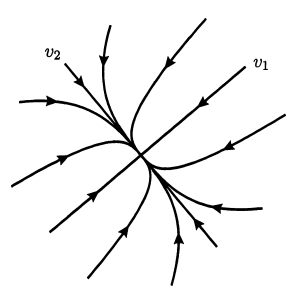{width=30%}  |  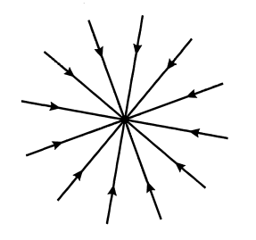{width=30%}

**不稳定结点(unstable node)：** $\lambda_1\geq\lambda_2>0$

不稳定结点 | 不稳定奇结点
:-------------------------:|:-------------------------:
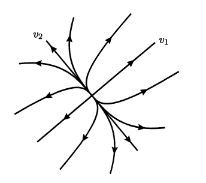{width=30%}  |  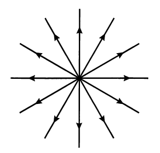{width=30%}

**鞍点(saddle point)：** $\lambda_1<0<\lambda_2$

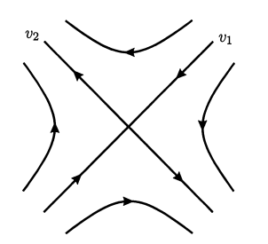{width=30%}

\newpage

若 $A$ 有Jordan标准型 $\begin{pmatrix}\lambda&1\\0&\lambda\end{pmatrix}$ ，其中 $\lambda$ 为非零实数，则有如下情况。

**稳定结点(stable node)：** $\lambda<0$

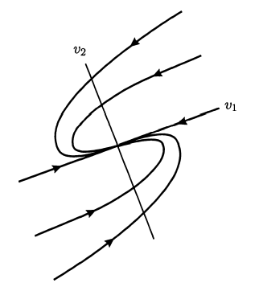{width=30%}

**不稳定结点(unstable node)：** $\lambda>0$

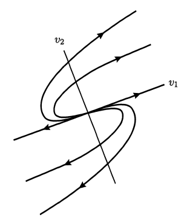{width=30%}

\newpage

若 $A$ 的特征值是一对共轭复根 $a\pm ib,b\neq 0$ ，则有如下情况。

**中心(center)：** $a=0$

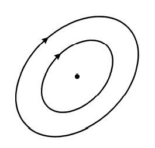{width=30%}

**稳定焦点(stable focus)：** $a<0$

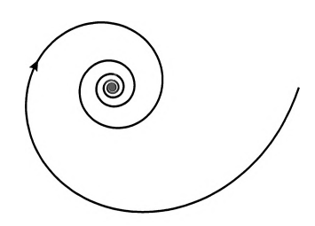{width=30%}

**不稳定焦点(unstable focus)：** $a>0$

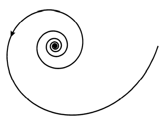{width=30%}

  

## 2.4 Equations with periodic coefficients

$\color{red}\bf Thm\ 2.31\text{ (Floquet)}$

设 $A(t)\in\mathbb{R^{n\times n}}$ 连续、以 $T$ 为周期，则 $x'=A(t)x$ 的任何基解矩阵都可以表示为 $X(t)=P(t)\exp(Bt)$ ，其中 $P(t)\in\mathbb{C^{n\times n}}$ 连续、以 $T$ 为周期， $B\in\mathbb{C^{n\times n}}$ 。

**证明**：注意到若 $X(t)$ 是基解矩阵，则 $X(T+t)$ 也是基解矩阵，从而存在可逆阵 $C$ 使得 $X(t+T)=X(t)C$ 。定义矩阵对数函数可以证明，存在 $B$ 使得 $C=\exp(BT)$ 。取 $P(t)=X(t)\exp(-Bt)$ 即可。

$\bf Def\ 2.32$

设 $A(t)\in\mathbb{R^{n\times n}}$ 连续、以 $T$ 为周期， $X(t)$ 是 $x'=A(t)x$ 的基解矩阵：

1. 可逆阵 $C$ 使得 $X(t+T)=X(t)C$ 称为**单值矩阵(monodromy matrix)**；
2. 单值矩阵的特征值称为**特征乘子(characteristic multipliers)**；
3. 复数 $\lambda\in\mathbb{C}$ 使得 $\mathrm{e}^{\lambda T}$ 是特征乘子称为**特征指数(characteristic exponent)**。

显然特征指数相差 $2\pi i/T$ 仍是特征指数。例如Floquet定理中的 $\exp(BT)$ 就是单值矩阵，它的特征值是特征乘子，从而 $B$ 的特征值就是特征指数。

注意该定义不要求 $T$ 是最小正周期，因此该定义（包括下面的定理与命题）**与 $T$ 的选取有关**！！！

$\color{red}\bf Prop\ 2.33$

设 $A(t)\in\mathbb{R^{n\times n}}$ 连续、以 $T$ 为周期， $X(t),Y(t)$ 是 $x'=A(t)x$ 的基解矩阵，相应的单值矩阵为 $C,D$ ，则 $C$ 与 $D$ 相似。因此特征乘子与基解矩阵的选取无关。

$\color{red}\bf Prop\ 2.36$

设 $A(t)\in\mathbb{R^{n\times n}}$ 连续、以 $T$ 为周期。则 $\lambda$ 是 $x'=A(t)x$ 的特征指数当且仅当存在非零的 $T$ 周期函数 $p(t):\mathbb{R}\to\mathbb{C^n}$ 使得 $\mathrm{e}^{\lambda t}p(t):\mathbb{R}\to\mathbb{R^n}$ 是方程的解。

由命题可知，若 $1$ 是特征乘子，则 $\lambda=2\pi i/T$ 是特征指数，则方程有 $T$ 周期解 $\mathrm{e}^{\lambda t}p(t)$ 。

$\color{red}\bf Prop\ 2.39$

设 $A(t)\in\mathbb{R^{n\times n}}$ 连续、以 $T$ 为周期， $x'=A(t)x$ 的特征乘子为 $\rho_i=\mathrm{e}^{\lambda_i T}$ ， $i=1,2,\dots,n$ ，则

1. $\displaystyle\prod_{i=1}^n\rho_i=\exp\int_0^T\mathrm{tr}A(s)\mathrm{d}s$
2. $\displaystyle\sum_{i=1}^n\lambda_i=\frac{1}{T}\int_0^T\mathrm{tr}A(s)\mathrm{d}s\mod\frac{2\pi i}{T}$

令 $s=\mathrm{Re}\sum_{i=1}^n\lambda_i$ ，则由Prop2.36可知

1. 若 $s>0$ ，则存在某个 $\mathrm{Re}\lambda_i>0$ ，从而方程有解在 $\mathbb{R^+}$ 无界；
2. 若 $s<0$ ，则存在某个 $\mathrm{Re}\lambda_i<0$ ，从而方程有解在 $\mathbb{R^-}$ 无界。

  

## 2.5 Conjugacies between linear equations

### 2.5.1 Notion of conjugacy

两个不同的常系数线性微分方程组的相图可能是一样的，这是因为相图丢失了时间 $t$ 的信息。我们希望从定性的角度研究它们之间的关系。

$\bf Def\ 2.44$

常系数线性微分方程组 $x'=Ax$ 和 $y'=By$ 的解分别为 $x(t)=\mathrm{e}^{At}x(0)$ 和 $y(t)=\mathrm{e}^{Bt}y(0)$ 。如果存在双射 $h:\mathbb{R^n}\to\mathbb{R^n}$ 使得 $h(\mathrm{e}^{At}x)=\mathrm{e}^{Bt}h(x)$ 对任意的 $t\in\mathbb{R}$ 和 $x\in\mathbb{R^n}$ 成立，并且

1. 若 $h$ 是同胚（即 $h,h^{-1}$ 都连续），则称这两个动力系统**拓扑共轭(topologically conjugate)**；
2. 若 $h$ 是微分同胚（即 $h,h^{-1}$ 都可微），则称这两个动力系统**微分共轭(differentially conjugate)**；
3. 若 $h$ 是线性函数（即 $h(x)=Cx,x\in\mathbb{R^{n\times n}}$），则称这两个动力系统**线性共轭(linearly conjugate)**。

这两个动力系统定义了两个流 $\varphi_t(x)=\mathrm{e}^{At}x$ 和 $\psi_t(x)=\mathrm{e}^{Bt}x$ ，从而 $h(\mathrm{e}^{At}x)=\mathrm{e}^{Bt}h(x)$ 实际上是在说下面的图是交换的，即 $h\circ\varphi_t=\psi_t\circ h$ 。

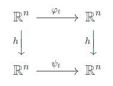{width=20%}

<!--
$$\begin{CD}
\mathbb{R^n}@>\varphi_t>>\mathbb{R^n}\\
@VhVV @VhVV\\
\mathbb{R^n}@>\psi_t>>\mathbb{R^n}\\
\end{CD}$$
-->

 

### 2.5.2 Linear conjugacies

$\color{red}\bf Prop\ 2.45$

常系数线性微分方程组 $x'=Ax$ 和 $y'=By$ 微分共轭当且仅当线性共轭。

$\color{red}\bf Prop\ 2.47$

常系数线性微分方程组 $x'=Ax$ 和 $y'=By$ 线性共轭当且仅当矩阵 $A,B$ 相似。

 

### 2.5.3 Topological conjugacies

$\bf Def\ 2.48$

如果 $A\in\mathbb{R^{n\times n}}$ 的特征值的实部都非零，则称 $A$ 是**双曲的(hyperbolic)**。

$\bf Def\ 2.49$

设 $A\in\mathbb{R^{n\times n}}$ ，则 $m(A)$ 表示 $A$ 的具有正实部的特征值个数（计算重数）。

$\color{red}\bf Thm\ 2.50$

设 $A,B\in\mathbb{R^{n\times n}}$ 是双曲的，若 $m(A)=m(B)$ ，则常系数线性微分方程组 $x'=Ax$ 和 $y'=By$ 拓扑共轭。

双曲的条件不能去掉，反例： $\begin{cases}x'=-ay\\y'=ax\end{cases}$ 和 $\begin{cases}x'=-by\\y'=bx\end{cases}$ 不拓扑共轭，其中 $0<a<b$ （它们实际上是两个角速度不一样的中心）。

**证明**：在极坐标下它们的解分别是 $\begin{cases}r=r_0\\\theta=at+\theta_0\end{cases}$ 和 $\begin{cases}r=r_0\\\theta=bt+\theta_0\end{cases}$ 。

若两系统拓扑共轭，则 $h(r_0,at+\theta_0)=(h_1(r_0),bt+h_2(\theta_0))$ 。它的第二个分量 $h_2$ 满足 $h_2(at+\theta_0)=bt+h_2(\theta_0)$ 。从而 $h_2$ 将区间 $(\theta_0,2\pi a/b+\theta_0)$ 映成 $(h_2(\theta_0),2\pi+h_2(\theta_0))$ 。从而 $h_2$ 将圆弧映成圆周，这与 $h$ 是双射矛盾。

---

# Chapter 3 Stability and Lyapunov Function

## 3.1 Notions of stability

设 $f:D\to\mathbb{R^n}$ 连续， $D\subset\mathbb{R}\times\mathbb{R^n}$ 开集，初值问题 $x'=f(t,x),x(t_0)=x_0$ 的解记作 $x(t,t_0,x_0)$ 。

$\bf Def\ 3.1$

称 $x(t,t_0,x_0)$ **稳定(stable)**，如果 $\forall \varepsilon>0$ ，存在 $\delta>0$ 使得只要 $\|x_0'-x_0\|<\delta$ ，则

1. $x(t,t_0,x_0')$ 和 $x(t,t_0,x_0)$ 对于任意 $t>t_0$ 有定义；
2. $\|x(t,t_0,x_0')-x(t,t_0,x_0)\|<\varepsilon$ 对于任意 $t>t_0$ 成立。

$\bf Def\ 3.4$

称 $x(t,t_0,x_0)$ **渐近稳定(asymptotic)**，如果

1. $x(t,t_0,x_0)$ 稳定；
2. 存在 $\alpha>0$ 使得只要 $\|x_0'-x_0\|<\alpha$ ，则 $\|x(t,t_0,x_0')-x(t,t_0,x_0)\|\to 0$ 当 $t\to+\infty$ 。

一般来说，以上的定义与初始时间 $t_0$ 有关，但容易证明对于驻定方程，解的（渐近）稳定性与初始时间无关。

 

## 3.2 Stability of linear equations

### 3.2.1 Nonautonomous linear equations:general case

设 $A(t)\in\mathbb{R^{n\times n}}$ 连续。

$\color{red}\bf Prop\ 3.7$

1. $x'=A(t)x$ 的零解的（渐近）稳定性与初始时间 $t_0$ 无关；
2. $x'=A(t)x$ 的零解（渐近）稳定当且仅当 $x'=A(t)x$ 的任意解都（渐近）稳定。

$\bf Def\ 3.8$

如果零解是（渐近）稳定的，则称方程 $x'=A(t)x$ 是（渐近）稳定的。

$\color{red}\bf Thm\ 3.9$

设 $X(t)$ 是 $x'=A(t)x$ 的任意一个基解矩阵，则

1. $x'=A(t)x$ 稳定当且仅当 $X(t)$ 对 $t$ 一致有界；
2. $x'=A(t)x$ 渐近稳定当且仅当任意范数 $\|X(t)\|\to0$ ， $t\to+\infty$ 。

 

### 3.2.2 Constant coefficients and periodic coefficients

$\color{red}\bf Thm\ 3.10$

设 $A\in\mathbb{R^{n\times n}}$ ，则

1. $x'=Ax$ 稳定当且仅当 $A$ 的特征值的实部都非正，并且实部为零的特征值相应的Jordan块是对角阵；
2. $x'=Ax$ 渐近稳定当且仅当 $A$ 的特征值的实部都小于零；
3. $x'=Ax$ 不稳定当且仅当 $A$ 的特征值至少有一个实部大于零，或者实部为零的特征值相应的Jordan块不是对角阵；

$\color{red}\bf Thm\ 3.11$

设 $A(t)\in\mathbb{R^{n\times n}}$ 连续，以 $T$ 为周期，则由Floquet定理，其任意基解矩阵形如 $X(t)=P(t)\exp(Bt)$ 并且 $B$ 的特征值就是方程的特征指数（模 $2\pi i/T$ ），则

1. $x'=A(t)x$ 稳定当且仅当特征指数的实部都非正，并且实部为零的特征指数在 $B$ 中相应的Jordan块是对角阵；
2. $x'=A(t)x$ 渐近稳定当且仅当特征指数的实部都小于零；
3. $x'=A(t)x$ 不稳定当且仅当特征指数至少有一个实部大于零，或者实部为零的特征指数在 $B$ 中相应的Jordan块不是对角阵。

 

## 3.3 Stability under nonlinear perturbations

$\color{red}\bf Thm\ 3.12$

设 $A\in\mathbb{R^{n\times n}}$ 的特征值的实部都是负数， $g:\mathbb{R}\times\mathbb{R^n}$ 连续、关于 $x$ 局部Lipschitz 。若 $g(t,0)=0$ （为了保证下面相应的非齐次方程有零解），且 $\lim_{x\to 0}\sup_{t\in\mathbb{R}}\frac{\|g(t,x)\|}{\|x\|}=0$ （即 $g$ 是高阶项），则

1. 非齐次方程 $x'=Ax+g(t,x)$ 的零解渐近稳定；
2. 存在常数 $C,\lambda,\delta>0$ ，使得对于任意 $t_0\in\mathbb{R}$ 和解 $x(t)$ ，只要 $\|x(t_0)\|<\delta$ ，则 $\|x(t)\|\leq C\mathrm{e}^{-\lambda(t-t_0)}\|x(t_0)\|$ 对任意 $t>t_0$ 成立。

$\color{red}\bf Thm\ 3.13$

设 $f:\mathbb{R^n}\to\mathbb{R^n}$ 是 $C^1$ 的， $x_0$ 是 $x'=f(x)$ 的临界点，并且 $f$ 在 $x_0$ 处的Jacobi矩阵 $d_{x_0}f$ 特征值的实部都是负数，则

1. 对于任意 $t_0\in\mathbb{R}$ ，初值问题 $x'=f(x),x(t_0)=x_0$ 的解渐近稳定；
2. 存在常数 $C,\lambda,\delta>0$ ，使得对于任意 $t_0\in\mathbb{R}$ ，只要 $\|\tilde x_0-x_0\|<\delta$ ，则初值问题 $x'=f(x),x(t_0)=\tilde x_0$ 的解 $x(t)$ 满足 $\|x(t)-x_0\|\leq C\mathrm{e}^{-\lambda(t-t_0)}\|\tilde x_0-x_0\|$ 对任意 $t>t_0$ 成立。

$\bf Rmk$

Thm4.9将这个定理推广到了 $d_{x_0}f$ 是双曲（Def2.48，即特征值的实部都非零）的情况

$\color{red}\bf Thm\ 3.14$

设 $A(t)\in\mathbb{R^{n\times n}}$ 连续。若 $x'=A(t)x$ 的基解矩阵 $X(t)$ 满足 $\|X(t)X(s)^{-1}\|\leq c\mathrm{e}^{-\mu(t-s)}$ 对任意 $t\geq s$ 成立，其中 $c,\mu>0$ ，则非齐次方程 $x'=A(t)x+g(t,x)$ 的零解渐近稳定。

  

## 3.4 Lyapunov functions

### 3.4.1 Basic notions

设 $f:D\subset\mathbb{R^n}\to\mathbb{R^n}$ 满足局部Lipschitz条件， $V:D\to\mathbb{R}$ 可微。定义一个新的函数 $\dot{V}(x)=\nabla V\cdot f(x)=\sum_{i=1}^n \frac{\partial V}{\partial x_i}f_i$ ，称为 $V$ 通过 $f$ 的全导数。

设初值问题 $x'=f(x),x(0)=x$ 的解为 $\varphi_t(x)=x(t,x)$ ，则 $\dot{V}(x)=\frac{\mathrm{d}}{\mathrm{d}t}V(\varphi_t(x))|_{t=0}$ 。

$\bf Def\ 3.16$

给定临界点 $x_0\in D$ ，即 $f(x_0)=0$ ，若一个可微函数 $V:D\to\mathbb{R}$

1. 存在 $x_0$ 的开邻域 $U\subset D$ 使得 $V$ 定正并且 $\dot{V}$ 常负，则称 $V$ 为 $x_0$ 处的**Lyapunov函数**；
2. 存在 $x_0$ 的开邻域 $U\subset D$ 使得 $V$ 定正并且 $\dot{V}$ 定负，则称 $V$ 为 $x_0$ 处的**严格Lyapunov函数**。

$\bf Rmk$

1. $f$ 在 $U\ni x_0$ 定正是指 $f(x)\geq0,x\in U$ 并且 $f(x)=0\Leftrightarrow x=x_0$ ；
2. $f$ 在 $U\ni x_0$ 常正是指 $f(x)\geq 0,x\in U$ 。

 

### 3.4.2 Stability criterion

$\color{red}\bf Thm\ 3.18$

设 $f:D\subset\mathbb{R^n}\to\mathbb{R^n}$ 满足局部Lipschitz条件， $x_0\in D$ 是方程 $x'=f(x)$ 的一个临界点，则

1. 若存在一个 $x_0$ 处的Lyapunov函数，则 $x_0$ 稳定；
2. 若存在一个 $x_0$ 处的严格Lyapunov函数，则 $x_0$ 渐近稳定。

 

### 3.4.3 Instability criterion

$\color{red}\bf Thm\ 3.23$

设 $f:D\subset\mathbb{R^n}\to\mathbb{R^n}$ 满足Lipschitz条件， $x_0\in D$ 是方程 $x'=f(x)$ 的一个临界点。若存在满足 $C^1$ 的函数 $V:U\to\mathbb{R}$ 定义在 $x_0$ 的一个邻域 $U\subset D$ 使得

1. $\dot{V}(x)>0,\forall x\in U\backslash\{x_0\}$ ；
2. $V(x_0)=0$ 且 $V$ 在 $x_0$ 的任意邻域都能取到正值，

则 $x_0$ 不稳定。

---

# Chapter 4 Hyperbolicity and Topological Conjugacies

## 4.1 Hyperbolic critical points

$\bf Def\ 4.1$

方程 $x'=f(x)$ 的临界点 $x_0$ （即 $f(x_0)=0$ ）称是**双曲临界点(hyperbolic critical point)** 如果Jacobi矩阵 $d_{x_0}f$ 是双曲的（Def2.48，即特征值的实部都非零）。

$\bf Def\ 4.2$

设 $x_0$ 是 $x'=f(x)$ 的双曲临界点，则
$$
E^s=\{x\in\mathbb{R^n}:\mathrm{e}^{At}x\to 0,t\to+\infty\}
$$
和
$$
E^u=\{x\in\mathbb{R^n}:\mathrm{e}^{At}x\to 0,t\to-\infty\}
$$
分别称为 $x_0$ 的**稳定空间(stable spaces)** 和**不稳定空间(unstable spaces)** 。

$\color{red}\bf Prop\ 4.3$

设 $x_0$ 是 $x'=f(x)$ 的双曲临界点，则

1. 作为线性空间， $E^s$ 和 $E^s$ 是 $\mathbb{R^n}$ 的子空间，并且 $E^s\oplus E^u=\mathbb{R^n}$ （子空间的直和）；
2. 若 $x\in E^s,y\in E^u$ ，则对于任意 $t\in\mathbb{R}$ ， $\mathrm{e}^{At}x\in E^s,\mathrm{e}^{At}y\in E^u$ 。

  

## 4.2 The Grobman-Hartman theorem

$\color{red}\bf Thm\ 4.7\text{ (Grobman-Hartman theorem)}$

设 $f:\mathbb{R^n}\to\mathbb{R^n}$ 是 $C^1$ 的， $x_0$ 是 $x'=f(x)$ 的双曲临界点，则方程 $x'=f(x)$ 和 $y'=(d_{x_0}f)y$ 的解分别在 $x_0$ 和 $0$ 的邻域拓扑共轭。具体来说，设 $\varphi_t(z)$ 和 $\psi_t(z)$ 分别是初值问题 $x'=f(x),x(0)=z$ 和 $y'=(d_{x_0}f)y,y(0)=z$ 定义的流，则存在 $x_0,0$ 的开邻域 $U,V$ 和同胚 $h:U\to V$ 使得 $h(x_0)=0$ ，并且只要 $z$ 和 $\varphi_t(z)\in U$ ，则有 $h(\varphi_t(z))=\psi_t(h(z))$

下面的是Thm3.13的推广，解决了部分非齐次方程的临界点的稳定性判定问题。

$\color{red}\bf Thm\ 4.9$

设 $f:\mathbb{R^n}\to\mathbb{R^n}$ 是 $C^1$ 的， $x_0$ 是 $x'=f(x)$ 的双曲临界点，则

1. 若矩阵 $d_{x_0}f$ 的特征值的实部都是负数，则 $x_0$ 渐近稳定；
2. 若矩阵 $d_{x_0}f$ 的特征值的实部存在正数，则 $x_0$ 不稳定。

---

# Chapter 6 Index Theory

## 6.1 Index for vector fields in the plane

若连续函数 $\gamma=(\gamma_1,\gamma_2):I=[0,1]\to\mathbb{R}^2$ 满足 $\gamma(0)=\gamma(1)$ 且 $\gamma|_{(0,1)}$ 是单射，则称 $\gamma$ 为一个闭道路。

设 $f=(f_1,f_2):\mathbb{R}^2\to\mathbb{R}^2$ 是 $C^1$ 的向量场，则有第二类曲线积分
$$
\int_\gamma f=\int_0^1f(\gamma(t))\gamma'(t)\mathrm{d}t=\int_0^1f_1(\gamma(t))\gamma_1'(t)\mathrm{d}t+f_2(\gamma(t))\gamma_2'(t)\mathrm{d}t
$$

$\bf Def\ 6.3$

给定一个闭道路 $\gamma$ 使得 $f$ 在 $\gamma$ 上不取零，则 
$$
\mathrm{Ind}_f(\gamma)=\frac{1}{2\pi}\int_\gamma\frac{f_1\nabla f_2-f_2\nabla f_1}{f_1^2+f_2^2}
$$
称为 $\gamma$ 关于 $f$ 的**指标(index)**。显然 $\mathrm{Ind}_f(-\gamma)=-\mathrm{Ind}_f(\gamma)$ 。

$\color{red}\bf Prop\ 6.4$

设 $f(x)\neq 0$ ，则函数
$$
\theta(x)=\begin{cases}
\arctan(f_2(x)/f_1(x))&f_1(x)>0\\
\pi/2&f_1(x)=0\And f_2(x)>0\\
\arctan(f_2(x)/f_1(x))+\pi&f_1(x)<0\\
-\pi/2&f_1(x)=0\And f_2(x)<0\\
\end{cases}
$$
表示在 $x$ 处，向量场 $f(x)$ 的辐角。注意到 $\theta(x)$ 的梯度
$$
\nabla\theta=\frac{f_1\nabla f_2-f_2\nabla f_1}{f_1^2+f_2^2}
$$
在 $\{x:f(x)\neq 0\}$ 有定义。则容易证明
$$
\mathrm{Ind}_f(\gamma)=\frac{1}{2\pi}\int_\gamma\nabla\theta=\frac{1}{2\pi}\int_0^1\frac{\mathrm{d}}{\mathrm{d}t}\theta(\gamma(t))\mathrm{d}t
$$
由于 $\gamma(0)=\gamma(1)$ ， $\mathrm{Ind}_f(\gamma)$ 是整数。其几何意义是沿着 $\gamma$ 绕一圈，向量场 $f$ 转的圈数。

$\color{red}\bf Prop\ 6.6$

设 $f:\mathbb{R}^2\to\mathbb{R}^2$ 是 $C^1$ 的向量场，若 $f(x_0)\neq 0$ ，则在 $x_0$ 的一个充分小的邻域内的任意闭道路 $\gamma$ 的指标 $\mathrm{Ind}_f(\gamma)=0$ 。

$\color{red}\bf Prop\ 6.8,6.9$

1. 若 $\gamma_0,\gamma_1$ 同伦、每一个切片都是闭道路，并且 $f$ 在每一个切片上都不为零，则 $\mathrm{Ind}_f(\gamma_0)=\mathrm{Ind}_f(\gamma_1)$ ；
2. 若 $f_0,f_1$ 同伦、每一个切片都是 $C^1$ 的，并且每一个切片 $f_s$ 在 $\gamma$ 上都不为零，则 $\mathrm{Ind}_{f_0}(\gamma)=\mathrm{Ind}_{f_1}(\gamma)$ 。

 

## 6.2 Applications of the notion of index

$\color{red}\bf Prop\ 6.13$

设 $f:\mathbb{R}^2\to\mathbb{R}^2$ 是 $C^1$ 的向量场， $\gamma:I\to\mathbb{R}^2$ 是闭道路，则

1. 若 $\gamma$ 所围的内部没有方程 $x'=f(x)$ 的临界点，则 $\mathrm{Ind}_f(\gamma)=0$ ；
2. 若 $\mathrm{Ind}_f(\gamma)\neq0$ ，则 $\gamma$ 所围的内部至少有一个方程 $x'=f(x)$ 的临界点。

$\color{red}\bf Prop\ 6.14$

1. 设 $f:\mathbb{R}^2\to\mathbb{R}^2$ 是 $C^1$ 的向量场， $\gamma:I\to\mathbb{R}^2$ 是闭道路，若 $\gamma([0,1])$ 是 $x'=f(x)$ 的一个周期轨道，则 $\mathrm{Ind}_f(\gamma)=\pm1$ ；
2. $x'=f(x)$ 的任意周期轨道所围的内部至少含有一个临界点。

 

## 6.3 Index of an isolated critical point

$\bf Def\ 6.19$

设 $f:\mathbb{R}^2\to\mathbb{R}^2$ 是 $C^1$ 的向量场， $x_0$ 是 $x'=f(x)$ 的孤立临界点，若 $\gamma$ （取正方向）包围的内部只含有 $x_0$ ，则 $\mathrm{Ind}_f(\gamma)$ 称为 $x_0$ 的指标，记作 $\mathrm{Ind}_f(x_0)$ 。

$\color{red}\bf Prop\ 6.20$

鞍点的指标是 $-1$ ，其余孤立临界点的指标是 $1$ 。

$\color{red}\bf Prop\ 6.21$

设 $f:\mathbb{R}^2\to\mathbb{R}^2$ 是 $C^1$ 的向量场， $\gamma$ （取正方向）包围的内部含有有限个孤立临界点 $x_1,x_2,\dots,x_n$ ，则
$$
\mathrm{Ind}_f(\gamma)=\sum_{i=1}^n\mathrm{Ind}_f(x_i)
$$

---

# Chapter 7 Poincare-Bendixson Theory

## 7.1 Limit sets

设 $f:\mathbb{R^n}\to\mathbb{R^n}$ 连续、满足Lipschitz条件，初值问题 $x'=f(x),x(0)=x_0$ 的解记作 $\varphi_t(x_0)$ ，最大存在区间记作 $I_{x_0}$ 。

$\bf Def\ 7.1$

若集合 $A\subset\mathbb{R^n}$ 满足 $\forall x\in A,t\in I_x$ 都有 $\varphi_t(x)\in A$ ，则称 $A$ 是**不变的(invariant)**。

$\bf Def\ 7.3$

给定 $x\in\mathbb{R^n}$

1. $\gamma(x)=\{\varphi_t(x):t\in I_x\}$ 是轨线(orbit)；
2. $\gamma^+(x)=\{\varphi_t(x):t\in I_x\cap\mathbb{R^+}\}$ 是正半轨线(positive semiorbit)；
3. $\gamma^-(x)=\{\varphi_t(x):t\in I_x\cap\mathbb{R^-}\}$ 是负半轨线(negative semiorbit)。

$\bf Def\ 7.4$

给定 $x\in\mathbb{R^n}$

1. $\alpha(x)=\displaystyle\bigcap_{y\in\gamma(x)}\overline{\gamma^-(y)}$ 称为 $\alpha$-极限集
2. $\omega(x)=\displaystyle\bigcap_{y\in\gamma(x)}\overline{\gamma^+(y)}$ 称为 $\omega$-极限集

$\color{red}\bf Prop\ 7.8$

若 $\gamma^+(x)$ 有界，则

1. $\omega(x)$ 紧致、连通、非空；
2. $y\in\omega(x)$ 当且仅当存在数列 $t_k\to+\infty$ 使得 $\varphi_{t_k}(x)\to y$ ；
3. 对任意 $t>0$ 和 $y\in\omega(x)$ 都有 $\varphi_t(y)\in\omega(x)$ ；
4. 距离 $d(\varphi_t(x),\omega(x))\to 0$ ， $t\to+\infty$ 。

若 $\gamma^-(x)$ 有界，则

1. $\alpha(x)$ 紧致、连通、非空；
2. $y\in\alpha(x)$ 当且仅当存在数列 $t_k\to-\infty$ 使得 $\varphi_{t_k}(x)\to y$ ；
3. 对任意 $t<0$ 和 $y\in\alpha(x)$ 都有 $\varphi_t(y)\in\alpha(x)$ ；
4. 距离 $d(\varphi_t(x),\alpha(x))\to 0$ ， $t\to-\infty$ 。

  

## 7.2 The Poincare-Bendixson theorem

$\color{red}\bf Thm\ 7.11\ (Poincare-Bendixson)$

设 $f:\mathbb{R^2}\to\mathbb{R^2}$ 是 $C^1$ 的，对于方程 $x'=f(x)$

1. 若 $\gamma^+(x)$ 有界，且极限集 $\omega(x)$ 不含有临界点，则 $\omega(x)$ 是一个周期轨线；
2. 若 $\gamma^-(x)$ 有界，且极限集 $\alpha(x)$ 不含有临界点，则 $\alpha(x)$ 是一个周期轨线。