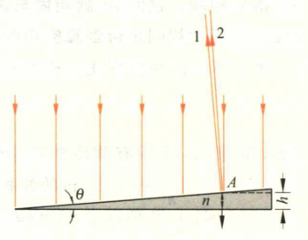

# 电学

## 第十二章 静电场

- 两个静止的点电荷的作用力 $F=\dfrac{q_1q_2}{4\pi\varepsilon_0r^2}$
- 高斯定律 $\oint_S \vec E\cdot\mathrm{d}\vec S=\dfrac{1}{\varepsilon_0}\sum Q$
- 电偶极子的电矩 $\vec p=q\vec l$ 方向从负电荷指向正电荷
  - 连接+q和-q两个点电荷的直线称为电偶极子的轴线。
  - 电偶极子受匀强电场的力矩 $\vec M=\vec p\times\vec E$
- 计算电场强度的方法
  - 定义（试探电荷）
  - 高斯定律
  - 叠加原理

## 第十三章 电势

- 环路定理 $\oint_L \vec E\cdot\mathrm{d}\vec r=0$
- 电势 $\varphi_P=\int_P^{'0'}\vec E\cdot\mathrm{d}\vec r$
- 电势与电场强度的关系 $\vec E=-\nabla\varphi$
- 接地：电势为零（此时无穷远也是零）
- 电势差 $U_{AB}=\varphi_A-\varphi_B=\int_A^B\vec E\cdot\mathrm{d}\vec r$
- 电势能 $W_P=q\varphi_P$
- 计算电势的方法
  - 定义（积分到电势零点）
  - 叠加原理

## 第十五章 静电场中的电介质

- 相对介电常数 $\varepsilon_r$ ，介电常数 $\varepsilon=\varepsilon_0\varepsilon_r$
- 电极化强度：单位体积内分子电矩的矢量和
- 电位移的高斯定律 $\oint_S\vec D\cdot\mathrm{d}\vec S=\sum Q$
  - 定义 $\vec D=\varepsilon_0\vec E+\vec P$
  - 对于各向同性的电介质有 $\vec D=\varepsilon_0\varepsilon_r\vec E=\varepsilon\vec E$
  - 从而 $\vec P=\varepsilon_0(\varepsilon_r-1)\vec E=(1-1/\varepsilon_r)\vec D$
  - 束缚电荷密度 $\sigma'=\vec P\cdot \vec e_n$
- 电容 $C=\dfrac{Q}{U}$
  - 平行板电容器 $C=\dfrac{\varepsilon_0\varepsilon_rS}{d}$
  - 串联 $\dfrac{1}{C}=\sum\dfrac{1}{C_i}$
  - 并联 $C=\sum C_i$
  - 电容器的能量 $W=\dfrac{1}{2}QU$
- 电场能量密度 $w_e=\dfrac{1}{2}\vec E\cdot\vec D$

# 磁学

## 第十六章 恒定电流

- 电流微观表达式 $I=vnqS$
- 电阻 $R=\rho\dfrac{l}{S}$
- 基尔霍夫第一方程 $\sum I_i=0$
- 基尔霍夫第二方程 $\sum(\mp\mathscr E_i)+\sum(\pm I_iR_i)=0$

## 第十七章 磁场和它的源

- 圆形电流的磁矩 $\vec m=I\vec S$ （右手螺旋定则）
- 无源场 $\oint_S\vec B\cdot\mathrm{d}\vec S=0$
- 毕奥萨伐尔定律 $\mathrm{d}\vec B=\dfrac{\mu_0}{4\pi}\dfrac{I\mathrm{d}\vec l\times\vec e_r}{r^2}$
  - 圆电流中心磁感应强度 $B=\dfrac{\mu_0I}{2R}$
- 安培环路定理 $\oint_L\vec B\cdot\mathrm{d}\vec r=\mu_0\sum I$
  - 无限长直电流 $B=\dfrac{\mu_0I}{2\pi r}$
  - 无限长螺线管 $B=\mu_0nI$ ， $n$ 是单位长度匝数
  - 无限长螺绕管 $B=\mu_0nI$

## 第十八章 磁力

- 洛伦兹力 $\vec F=q\vec v\times\vec B$
- 安培定律 $\mathrm{d}\vec F=I\mathrm{d}\vec l\times\vec B$
  - 在**均匀磁场**中，任意形状导线的安培力只需考虑有效长度
  - 在**均匀磁场**中，闭合载流回路安培力为零
- 载流线圈受匀强磁场的力矩 $\vec M=\vec m\times\vec B$
- 平行导线单位长度受力 $F=\dfrac{\mu_0I_1I_2}{2\pi d}$

## 第十九章 磁场中的磁介质

- 相对磁导率 $\mu_r$ ，磁导率 $\mu=\mu_0\mu_r$
- 磁化强度：单位体积内分子磁矩的矢量和
- 磁场强度的环路定律 $\oint_L\vec H\cdot\mathrm{d}\vec r=\sum I$
  - 定义 $\vec H=\dfrac{\vec B}{\mu_0}-\vec M$
  - 对于各向同性的磁介质有 $\vec H=\dfrac{\vec B}{\mu_0\mu_r}=\dfrac{\vec B}{\mu}$
  - 从而 $\vec M=\dfrac{\mu_r-1}{\mu_0\mu_r}\vec B=(\mu_r-1)\vec H$
  - 面束缚电流密度 $\vec j'=\vec M\times\vec e_n$

## 第二十章 电磁感应

- 随意选取回路的正方向，感生电动势 $\mathscr{E}=-\dfrac{\mathrm{d}\Psi}{\mathrm{d}t}$
  - $\Psi=n\Phi$ 表示磁链，即磁通乘以匝数
- 动生电动势 $\mathscr{E}=Blv$
  - 在**均匀磁场**中，只需考虑有效长度
- 自感系数 $L=\dfrac{\Psi}{I}$ ，单位亨利(H)，下同
  - 自感电动势 $\mathscr{E}=-L\dfrac{\mathrm{d}I}{\mathrm{d}t}$
- 互感系数 $M_{21}=\dfrac{\Psi_{21}}{I_1}$
  - $M=M_{21}=M_{12}$
  - 互感电动势 $\mathscr{E_{21}}=-M\dfrac{\mathrm{d}I_1}{\mathrm{d}t}$
- 磁场能量密度 $w_m=\dfrac{1}{2}\vec B\cdot\vec H$

# 光学

## 第二十二章 光的干涉

### 双缝干涉

- 条纹间距 $\Delta x=\dfrac{D}{d}\lambda$
- 光程差 $\delta=d\sin\theta$
  - 明条纹 $d\sin\theta=\pm k\lambda$ ， $k=0,1,2\dots$
  - 暗条纹 $d\sin\theta=\pm(k-1/2)\lambda$ ， $k=1,2,3\dots$

### 等厚条纹（劈尖干涉、牛顿环）

- 光疏介质中的光在光密介质表面反射有半波损失

- 如果劈尖放在空气中，则光程差 $\delta=2nh+\lambda/2$
  - 明条纹 $2nh+\lambda/2=k\lambda$ ， $k=1,2,3\dots$
  - 暗条纹 $2nh+\lambda/2=(k+1/2)\lambda$ ， $k=0,1,2\dots$

- 如果镜片放在空气中，则光程差 $\delta=2h+\lambda/2$
- $R^2=r^2+(R-h^2)$ ，由于 $R\gg h$ 略去高阶项有 $r=2Rh$
  - 明条纹 $2h+\lambda/2=k\lambda$ ，则 $r=\sqrt{(k-1/2)R\lambda}$ ， $k=1,2,3\dots$
  - 暗条纹 $2h+\lambda/2=(k+1/2)\lambda$ ，则 $r=\sqrt{kR\lambda}$ ， $k=0,1,2\dots$

### 等倾条纹

光程差 $\delta=2h\sqrt{n^2-\sin^2i}+\dfrac{\lambda}{2}$

## 第二十三章 光的衍射

### 单缝衍射

- 明条纹：奇数个半波带
  - 中心条纹中心 $\theta=0$
  - 明条纹中心（近似） $a\sin\theta=\pm(2k+1)\dfrac{\lambda}{2}$ ， $k=1,2,3\dots$
- 暗条纹：偶数个半波带
  - 暗条纹中心 $a\sin\theta=\pm2k\dfrac{\lambda}{2}$ ， $k=1,2,3\dots$
- 此式与杨氏双缝干涉条纹公式形式上相反，切勿混淆

### 圆孔衍射（艾里斑）

- 艾里斑角半径 $\delta\theta=1.22\dfrac{\lambda}{D}$ （光学仪器角分辨率）

### 光栅衍射

- 光栅长度 $d=a+b$ ，即光栅每一条透光部分与不透光部分宽度之和
- 主极大 $d\sin\theta=k\lambda$ ， $k=0,\pm1,\pm2\dots$

## 第二十四章 光的偏振

- 马吕斯定律：线性偏振光经过一个检偏器，光强变为 $I=I_0\cos^2\alpha$
  - 自然光入射，经过一个起偏器，光强变为 $I=I_0/2$
- 反射、折射时的偏振
  - 当入射角为布儒斯特角（起偏角） $i_b$ 时，反射光为垂直于入射面的线偏振光， $\tan i_b=n_2/n_1$
  - 当入射角为起偏角时，反射光与折射光的传播方向相互垂直