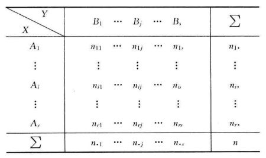
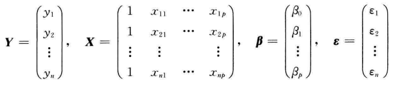
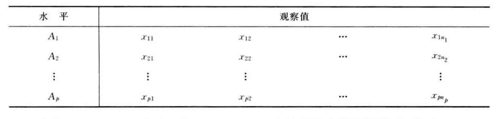
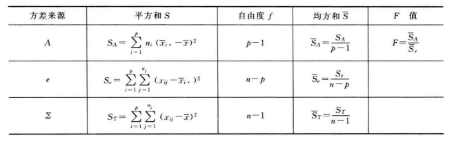
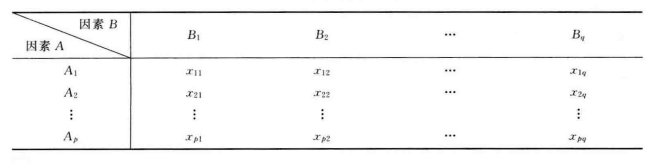
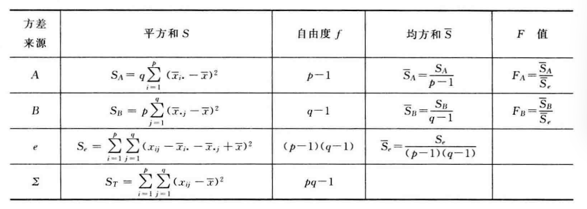
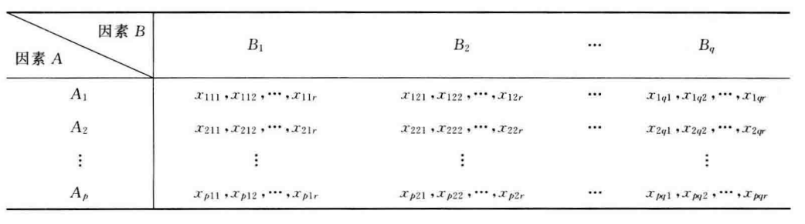
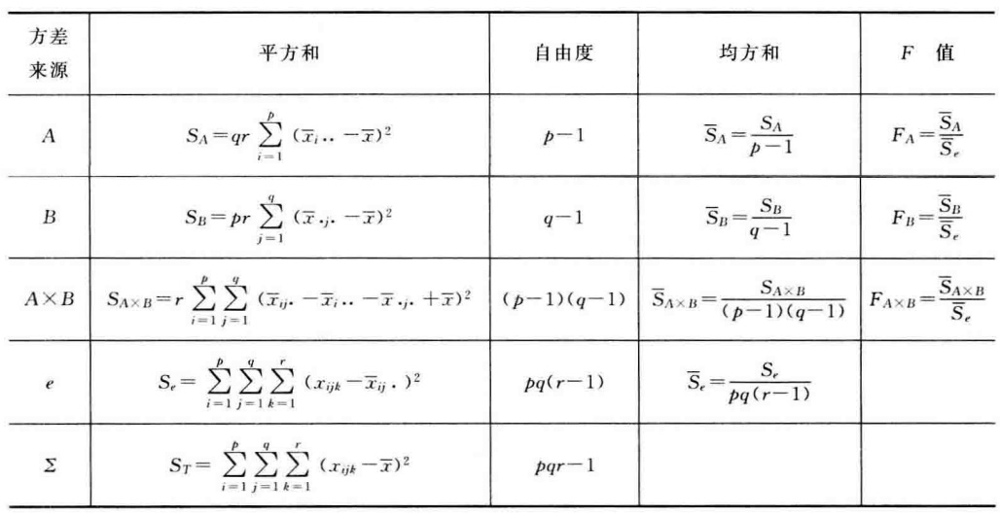

《数理统计》孙海燕

- [第一章 基础知识](#第一章-基础知识)
- [第二章 参数估计](#第二章-参数估计)
  - [2.1 点估计](#21-点估计)
    - [2.1.1 频率替换法](#211-频率替换法)
    - [2.1.3 极大似然估计](#213-极大似然估计)
  - [2.2 估计量的评优准则](#22-估计量的评优准则)
  - [2.3 信息不等式](#23-信息不等式)
  - [2.4 相合估计](#24-相合估计)
  - [2.5 区间估计](#25-区间估计)
- [第三章 假设检验](#第三章-假设检验)
  - [3.1 基本概念](#31-基本概念)
  - [3.2 正态总体参数的假设检验](#32-正态总体参数的假设检验)
    - [3.2.1 单个正态总体的均值的检验](#321-单个正态总体的均值的检验)
      - [方差已知（ $z$ 检验）](#方差已知-z-检验)
      - [方差未知（ $t$ 检验）](#方差未知-t-检验)
    - [3.2.2 单个正态总体的方差的检验](#322-单个正态总体的方差的检验)
      - [均值已知（ $\\chi^2$ 检验）](#均值已知-chi2-检验)
      - [均值未知（ $\\chi^2$ 检验）](#均值未知-chi2-检验)
    - [3.2.3 两个正态总体均值相等的检验](#323-两个正态总体均值相等的检验)
      - [方差已知（双样本 $z$ 检验）](#方差已知双样本-z-检验)
      - [方差未知，但方差相等（双样本 $t$ 检验）](#方差未知但方差相等双样本-t-检验)
      - [方差未知，但样本数相等（配对 $t$ 检验）](#方差未知但样本数相等配对-t-检验)
    - [3.2.4 两个正态总体方差相等的检验](#324-两个正态总体方差相等的检验)
      - [均值未知（ $F$ 检验）](#均值未知-f-检验)
      - [均值（部分）已知（ $F$ 检验）](#均值部分已知-f-检验)
  - [3.3 Pearson检验法](#33-pearson检验法)
    - [3.3.1 总体发布的 $\\chi^2$ 拟合检验](#331-总体发布的-chi2-拟合检验)
    - [3.3.2 二维列联表的独立性检验](#332-二维列联表的独立性检验)
  - [3.4 似然比检验](#34-似然比检验)
  - [3.5 检验的优良性](#35-检验的优良性)
- [第四章 回归分析](#第四章-回归分析)
  - [4.2 多元线性回归](#42-多元线性回归)
    - [4.2.2 最小二乘估计](#422-最小二乘估计)
    - [4.2.3 回归效果的显著性检验](#423-回归效果的显著性检验)
    - [4.2.4 单个回归系数的显著性检验与区间估计](#424-单个回归系数的显著性检验与区间估计)
      - [显著性检验](#显著性检验)
      - [区间估计](#区间估计)
  - [4.1 一元线性回归](#41-一元线性回归)
    - [4.1.2 最小二乘估计](#412-最小二乘估计)
    - [4.1.3 回归系数的显著性检验与置信区间](#413-回归系数的显著性检验与置信区间)
      - [显著性检验](#显著性检验-1)
      - [区间估计](#区间估计-1)
    - [计算器流程](#计算器流程)
- [第五章 方差分析](#第五章-方差分析)
  - [5.1 单因素试验方差分析](#51-单因素试验方差分析)
    - [计算器流程](#计算器流程-1)
  - [5.2 双因素试验方差分析](#52-双因素试验方差分析)
    - [5.2.1 无重复试验](#521-无重复试验)
    - [5.2.2 等重复试验](#522-等重复试验)
- [第七章 判别分析](#第七章-判别分析)
  - [7.1 两个总体的距离判别](#71-两个总体的距离判别)
  - [7.2 两个总体的Bayes判别](#72-两个总体的bayes判别)
- [第八章 相关分析](#第八章-相关分析)
  - [8.1 主成分分析](#81-主成分分析)
- [一元正态分布的常用结论](#一元正态分布的常用结论)
  - [1 常用点估计、枢轴变量及其分布](#1-常用点估计枢轴变量及其分布)
    - [1.1 单个正态总体](#11-单个正态总体)
      - [点估计](#点估计)
      - [枢轴变量及其分布](#枢轴变量及其分布)
    - [1.2 两个正态总体](#12-两个正态总体)
      - [点估计](#点估计-1)
      - [枢轴变量及其分布](#枢轴变量及其分布-1)
  - [2 极大似然估计](#2-极大似然估计)
  - [3 一致最小方差无偏估计](#3-一致最小方差无偏估计)

# 第一章 基础知识

$\bf Def\ (充分统计量)$

设统计量 $T=T(x_1,\dots,x_n)$ 是统计量，如果给定 $T=t$ 的条件下，样本的条件分布（离散总体为条件分布列、连续总体为条件密度函数）与参数无关，则称 $T$ 为充分统计量。

$\color{red}\bf Thm\ (因子分解定理)$

$T$ 是充分统计量，当且仅当样本 $x=(x_1,\dots,x_n)$ 的**联合分布**（离散总体为联合分布列、连续总体为联合密度函数）可以分解为

$$
p(x;\theta)=g(T(x),\theta)h(x)
$$

$\bf Def\ (三种分布)$

1. $n$ 个相互独立的标准正态分布的和是 $\chi^2\sim\chi^2(n)$ ， $E(\chi^2)=n$ ， $Var(\chi^2)=2n$ ；
2. 设 $X\sim N(0,1),Y\sim\chi^2(n)$ 相互独立，则 $t=\dfrac{X}{\sqrt{Y/n}}\sim t(n)$ ；
3. 设 $X\sim\chi^2(n_1),Y\sim\chi^2(n_2)$ 相互独立，则 $F=\dfrac{X/n_1}{Y/n_2}\sim F(n_1,n_2)$ 。

特别地，若 $t\sim t(n)$ ，则 $t^2\sim F(1,n)$ 。

---

# 第二章 参数估计

## 2.1 点估计

### 2.1.1 频率替换法

若 $n$ 次独立重复试验中，某种结果出现的次数是 $n_1$ ，用频率替换该结果发生的概率，得到方程 $P(\theta)=n_1/n$ ，求出参数的估计 $\hat\theta=Q(n_1/n)$ 。

  

### 2.1.3 极大似然估计

定义似然函数 $L(\theta)=\prod_{i=1}^np(x_i;\theta)$ 为联合概率分布。若在参数空间 $\Theta$ 中存在 $\hat\theta(x)$ 使得 $L(\hat\theta(x))=\sup_{\theta\in\Theta}L(\theta)$ ，则称 $\hat\theta(x)$ 为参数 $\theta$ 的极大似然估计。一般步骤：

1. 求出似然函数 $L(\theta)$ 和对数似然函数 $\ln L(\theta)$ ；
2. 求解似然方程组 $\dfrac{\partial L(\theta)}{\partial\theta_i}=0$ ， $i=1,2,\dots,m$ 得到极大似然估计。

参数 $\theta$ 的连续函数 $q(\theta)$ 的极大似然估计是 $q(\hat\theta)$ 。

  

## 2.2 估计量的评优准则

$\bf Def\ (无偏估计)$

设统计量 $T(x)$ 是参数 $q(\theta)$ 的估计。若对任意 $\theta\in\Theta$ ，有 $E_\theta(T(x))=q(\theta)$ ，则称 $T(x)$ 是 $q(\theta)$ 的无偏估计。

$\bf Def\ (均方误差)$

设统计量 $T(x)$ 是参数 $q(\theta)$ 的估计。则其均方误差为 $MSE_\theta(T(x))=E_\theta([T(x)-q(\theta)]^2)=Var_\theta(T(x))+[E_\theta(T(x)-q(\theta))]^2$ 。

用 $U_q=\{T(x):E_\theta(T(x))=q(\theta),Var_\theta(T(x))<\infty,\forall\theta\in\Theta\}$ 表示参数 $q(\theta)$ 的所有方差有限的无偏估计类。则对任何 $T(x)\in U_q$ ，有 $MSE_\theta(T(x))=Var_\theta(T(x))$ 。

$\bf Def\ (一致最小方差无偏估计)$

若存在无偏估计 $T(x)\in U_q$ 使得对任何估计 $T_0(x)\in U_q$ ，都有 $Var_\theta(T(x))\leq Var_\theta(T_0(x))$ 对所有 $\theta\in\Theta$ 成立，则称 $T(x)$ 是 $q(\theta)$ 的一致最小方差无偏估计。

$\color{red}\bf Thm\ (完全充分统计量)$

若样本 $x=(x_1,\dots,x_n)$ 的**联合分布**（离散总体为联合分布列、连续总体为联合密度函数）可以分解为

$$
p(x;\theta)=c(\theta)h(x)\exp\{w(\theta)\cdot T(x)\}=c(\theta)h(x)\exp\left\{\sum_{k=1}^mw_k(\theta)T_k(x)\right\}
$$

如果 $w(\theta)=(w_1(\theta),\dots,w_m(\theta))$ 的值域 $\Lambda\subset\mathbb{R}^m$ 有内点，则 $m$ 维统计量 $T(x)=(T_1(x),\dots,T_m(x))$ 是完全充分统计量。

$\bf Rmk$

1. 若能获得 $q(\theta)$ 的无偏估计 $\varphi(x)$ ，则 $\varphi(x)$ 关于完全充分统计量 $S(x)$ 的条件数学期望 $T(x)=E_\theta(\varphi(x)\mid S(x))$ 是 $q(\theta)$ 的一致最小方差无偏估计；
2. 若能获得完全充分统计量 $S(x)$ 的函数 $h(S(x))$ 使之成为 $q(\theta)$ 的无偏估计，则 $h(S(x))$ 是 $q(\theta)$ 的一致最小方差无偏估计。

  

## 2.3 信息不等式

$\bf Def\ (Fisher信息量)$

若**总体分布族** $\{p(x;\theta):\theta\in\Theta\}$ 是C-R正则族，则可以定义Fisher信息量为

$$
I(\theta)=E_\theta\left(\left[\frac{\partial}{\partial\theta}\ln p(x;\theta)\right]^2\right)
(Rmk:0\leq I(\theta)\leq+\infty)$$

若 $\int_{-\infty}^{+\infty}\frac{\partial^2}{\partial\theta^2}p(x;\theta)\mathrm{d}x=\frac{\partial^2}{\partial\theta^2}\int_{-\infty}^{+\infty}p(x;\theta)\mathrm{d}x=\frac{\partial^2}{\partial\theta^2}(1)=0$ ，则其等价于

$$
I(\theta)=-E_\theta\left(\frac{\partial^2}{\partial\theta^2}\ln p(x;\theta)\right)
$$

$\color{red}\bf Thm\ (信息不等式)$

若 $0<I(\theta)<+\infty$ （前提是C-R正则族），且统计量 $T(x)$ 方差有限，则对任意的 $\theta\in\Theta$

$$
Var_\theta(T(x))\geq\frac{1}{nI(\theta)}\left(\frac{\mathrm{d}}{\mathrm{d}\theta}E_\theta(T(x))\right)^2
$$

特别地，若 $T(x)$ 是 $\theta$ 的无偏估计，即 $E_\theta(T(x))=\theta$ ，从而得到统计量方差的C-R下界

$$
Var_\theta(T(x))\geq\frac{1}{nI(\theta)}
$$

若 $\theta$ 的无偏估计 $T(x)$ 达到了C-R下界（称为有效估计），则其必是一致最小方差无偏估计。

  

## 2.4 相合估计

略

  

## 2.5 区间估计

$\bf Def\ (置信区间)$

若存在两个统计量 $T_i=T_i(x)$ 使得 $P_\theta\{T_1(x)\leq\theta\leq T_2(x)\}\geq 1-\alpha$ 对所有 $\theta\in\Theta$ 都成立，则称 $[T_1,T_2]$ 是 $\theta$ 的置信水平为 $1-\alpha$ 的置信区间。

求置信区间的枢轴变量法：

1. 从点估计 $\hat\theta(x)$ 出发构造一个**仅包含统计量 $\hat\theta(x)$ 和参数 $\theta$ 并且分布完全已知**的函数 $g(\hat\theta(x),\theta)$ ，称为枢轴变量；
2. 对给定的置信水平，取两个常数 $a<b$ 使得 $P_\theta\{a\leq g(\hat\theta(x),\theta)\leq b\}\geq 1-\alpha$ （对常见分布 $a,b$ 一般选取为 $g(\hat\theta(x),\theta)$ 的分布的 $\alpha/2$ 和 $1-\alpha/2$ 分位数）；
3. 将不等式 $a\leq g(\hat\theta(x),\theta)\leq b$ 等价变换成 $T_1(x)\leq\theta\leq T_2(x)$ ，从而 $[T_1,T_2]$ 是 $\theta$ 的置信水平为 $1-\alpha$ 的置信区间。

$\bf Def\ (单侧置信区间)$

略

---

# 第三章 假设检验

## 3.1 基本概念

给定假设检验问题 $H_0:\theta\in\Theta_0$ 和拒绝域 $W$ ，则拒绝域上的示性函数 $\varphi(x)=I_W(x)$ 称为检验函数。
当原假设 $H_0$ 本来成立时，样本观察值却落入 $W$，这种错误称为第一类错误，即“弃真”的错误，其概率为

$$
\alpha(\theta)=P_\theta(x\in W),\theta\in\Theta_0
$$

当原假设 $H_0$ 本来不成立时，样本观察值却落入 $W^c$，这种错误称为第二类错误，即“取伪”的错误，其概率为

$$
\beta(\theta)=P_\theta(x\notin W)=1-P_\theta(x\in W),\theta\in\Theta_1
$$

$\bf Def\ (势和势函数)$

称 $H_0$ 不成立时拒绝 $H_0$ 的概率

$$
\gamma(\theta)=P_\theta(x\in W)=1-\beta(\theta),\theta\in\Theta_1
$$

为一个检验的势。函数

$$
g(\theta)=P_\theta(x\in W)=E_\theta(\varphi(x)),\theta\in\Theta
$$

称为势函数。当 $\theta\in\Theta_0$ 时， $g(\theta)=\alpha(\theta)$ ；否则 $g(\theta)=\gamma(\theta)=1-\beta(\theta)$ 。

$\bf Def\ (检验水平)$

若 $\sup_{\theta\in\Theta_0}\{P_\theta\{x\in W\}\}\leq\alpha$ ，即犯第一类错误的概率的上确界不大于 $\alpha$ ，则称该检验的显著性水平为 $\alpha$ 。

  

## 3.2 正态总体参数的假设检验

### 3.2.1 单个正态总体的均值的检验

$H_0:\mu=\mu_0$ ， $H_1:\mu\neq\mu_0$

#### 方差已知（ $z$ 检验）

检验统计量为 $z=\dfrac{\bar x-\mu_0}{\sqrt{\sigma^2/n}}\overset{H_0}\sim N(0,1)$ ，拒绝域为 $W=\{x:|z|\geq z_{1-\alpha/2}\}$ 。

#### 方差未知（ $t$ 检验）

检验统计量为 $t=\dfrac{\bar x-\mu_0}{\sqrt{S^2/n}}\overset{H_0}\sim t(n-1)$ ，拒绝域为 $W=\{x:|t|\geq t_{1-\alpha/2}(n-1)\}$ 。

  

### 3.2.2 单个正态总体的方差的检验

$H_0:\sigma^2=\sigma^2_0$ ， $H_1:\sigma^2\neq\sigma^2_0$

#### 均值已知（ $\chi^2$ 检验）

检验统计量为 $\chi^2=\dfrac{n\hat\sigma^2}{\sigma_0^2}\overset{H_0}\sim\chi^2(n)$ ，拒绝域为 $W=\{x:\chi^2\leq\chi^2_{\alpha/2}(n)\}\cup\{x:\chi^2\geq\chi^2_{1-\alpha/2}(n)\}$ 。

#### 均值未知（ $\chi^2$ 检验）

检验统计量为 $\chi^2=\dfrac{(n-1)S^2}{\sigma_0^2}\overset{H_0}\sim\chi^2(n-1)$ ，拒绝域为 $W=\{x:\chi^2\leq\chi^2_{\alpha/2}(n-1)\}\cup\{x:\chi^2\geq\chi^2_{1-\alpha/2}(n-1)\}$ 。

  

### 3.2.3 两个正态总体均值相等的检验

$H_0:\mu_1=\mu_2$ ， $H_1:\mu_1\neq\mu_2$

#### 方差已知（双样本 $z$ 检验）

检验统计量为 $z=\dfrac{\bar x-\bar y}{\sqrt{\dfrac{\sigma_1^2}{n_1}+\dfrac{\sigma_2^2}{n_2}}}\overset{H_0}\sim N(0,1)$ ，拒绝域为 $W=\{x:|z|\geq z_{1-\alpha/2}\}$ 。

#### 方差未知，但方差相等（双样本 $t$ 检验）

检验统计量为 $t=\dfrac{\bar x-\bar y}{\sqrt{\dfrac{S_w^2}{n_1}+\dfrac{S_w^2}{n_2}}}\overset{H_0}\sim t(n_1+n_2-2)$ ，拒绝域为 $W=\{x:|t|\geq t_{1-\alpha/2}(n_1+n_2-2)\}$ 。

#### 方差未知，但样本数相等（配对 $t$ 检验）

令 $z_i=x_i-y_i$ ，则 $z_1,\dots,z_n$ 可看作是正态总体 $N(\mu_1-\mu_2:=\mu,\sigma_1^2+\sigma_1^2:=\sigma^2)$ 的简单样本。假设检验问题化为单个正态总体在方差未知时的均值检验 $H_0:\mu=0$ ， $H_1:\mu\neq 0$ 。

检验统计量为 $t=\dfrac{\bar z}{S/\sqrt{n}}\overset{H_0}\sim t(n-1)$ ，拒绝域为 $W=\{x:|t|\geq t_{1-\alpha/2}(n-1)\}$ 。

  

### 3.2.4 两个正态总体方差相等的检验

$H_0:\sigma_1^2=\sigma_2^2$ ， $H_1:\sigma_1^2\neq\sigma_2^2$

#### 均值未知（ $F$ 检验）

检验统计量为 $F=\dfrac{S_1^2}{S_2^2}\overset{H_0}\sim F(n_1-1,n_2-1)$ ，拒绝域为 $W=\{x:F\leq F_{\alpha/2}(n_1-1,n_2-1)\}\cup\{x:F\geq F_{1-\alpha/2}(n_1-1,n_2-1)\}$ 。

#### 均值（部分）已知（ $F$ 检验）

将已知的均值对应的 $S_i^2$ 用 $\hat\sigma_i^2$ 代替，相应的自由度为 $n_i$ 。

例如若 $\mu_1$ 已知，则检验统计量为 $F=\dfrac{\hat\sigma_1^2}{S_2^2}\overset{H_0}\sim F(n_1,n_2-1)$ ，拒绝域为 $W=\{x:F\leq F_{\alpha/2}(n_1,n_2-1)\}\cup\{x:F\geq F_{1-\alpha/2}(n_1,n_2-1)\}$ 。

例如若 $\mu_i$ 都已知，则检验统计量为 $F=\dfrac{\hat\sigma_1^2}{\hat\sigma_2^2}\overset{H_0}\sim F(n_1,n_2)$ ，拒绝域为 $W=\{x:F\leq F_{\alpha/2}(n_1,n_2)\}\cup\{x:F\geq F_{1-\alpha/2}(n_1,n_2)\}$ 。

  

## 3.3 Pearson检验法

### 3.3.1 总体发布的 $\chi^2$ 拟合检验

$\color{red}\bf Thm\ (Pearson定理)$

设总体的分布函数为 $F_0(x)$ ，把随机试验结果的全体分成 $k$ 个互不相容的事件 $A_i$ ，其概率分别为 $p_i=P\{A_i\}$ 。设 $n$ 是样本容量，其中 $A_i$ 发生的频数为 $f_i$ 。根据大数定律，频率 $f_i/n$ 稳定于 $p_i$ ，因此统计量

$$
\chi^2=\sum_{i=1}^k\frac{(f_i-np_i)^2}{np_i}
$$

可以刻画 $f_i/n$ 与 $p_i$ 的差异程度。当样本容量 $n$ 充分大时，一般要求 $n\geq 50$ ，可以证明无论总体服从何种分布，统计量 $\chi^2$ 近似服从 $\chi^2(k-1)$ 分布。

$\bf Rmk$

设总体 $X$ 的分布函数为 $F(x;\theta)$ ， $F_0(x)$ 是指定的分布函数。 $x_1,\dots,x_n$ 是总体 $X$ 的简单样本，假设检验 $H_0:F(x)=F_0(x)$ 的方法为：

1. 把实轴分成 $k$ 个区间 $A_i=(a_i,a_{i+1}]$ 的不交并，要求 $n\geq 50,np_i\geq5$ ，最好 $np_i>10$ ，否则应适当合并该区间划分；
2. 用 $F_0(x)$ 分布计算概率 $p_i=F_0(a_{i+1})-F_0(a_i)$ ，并计算理论频数 $np_i$ ；
3. 计算样本观察值的实际频数 $f_i$ ；
4. 用检验统计量 $\chi^2$ 和拒绝域 $W=\{x:\chi^2\geq\chi^2_{1-\alpha}(k-1)\}$ 。

若 $\{F_0(x;\theta):\theta\in\Theta\}$ 是指定的分布函数族，其中 $\theta$ 含有 $\gamma$ 个分量，要先在假设 $H_0$ 成立的条件下，求出参数 $\theta$ 的极大似然估计 $\hat\theta$ ，才能计算出 $p_i=F_0(a_{i+1};\hat\theta)-F_0(a_i;\hat\theta)$ 。可以证明当 $n$ 充分大时， $\chi^2$ 近似服从 $\chi^2(k-\gamma-1)$ 分布，因此拒绝域为 $W=\{x:\chi^2\geq\chi^2_{1-\alpha}(k-\gamma-1)\}$

  

### 3.3.2 二维列联表的独立性检验

假设检验问题为 $H_0:p_{ij}=p_{i\cdot}p_{\cdot j}$ ，可以证明 $\chi^2$ 拟合检验化为检验统计量

$$
\chi^2=\sum_{i=1}^r\sum_{i=1}^s\frac{(n_{ij}-n_{i\cdot}n_{\cdot j}/n)^2}{n_{i\cdot}n_{\cdot j}/n}
$$

和拒绝域 $W=\{x:\chi^2\geq\chi^2_{1-\alpha}((r-1)(s-1))\}$ 。

  

## 3.4 似然比检验

对于一般的假设检验问题 $H_0:\theta\in\Theta_0, H_1:\theta\in\Theta_1$ ，定义似然比统计量
$$
\lambda(x)=\frac{\sup_{\theta\in\Theta}p(x;\theta)}{\sup_{\theta\in\Theta_0}p(x;\theta)}
$$
和拒绝域为 $W=\{x:\lambda(x)\geq c\}$ 。在实际计算过程中，一般先用求极大似然估计的方法，求出似然比统计了 $\lambda(x)$ 的表达式，然后将其表示成关于某个已知分布的统计量 $T$ 的函数，从而将 $W$ 等价变换成关于 $T$ 的拒绝域。

  

## 3.5 检验的优良性

略

---

# 第四章 回归分析

## 4.2 多元线性回归

### 4.2.2 最小二乘估计

设 $y$ 是随机变量，其分布依赖于 $p$ 个普通变量 $x_1,\dots,x_p$ 。采用矩阵记号

满足
$$
\mathrm{rank}(\boldsymbol X)=p+1\\[1ex]
\boldsymbol{Y=X\beta+\varepsilon}\\[1ex]
\boldsymbol\varepsilon\sim N(\boldsymbol 0,\sigma^2\boldsymbol I_n)\\[1ex]
$$

$\bf Def\ (最小二乘估计)$

使得误差平方和 $Q(\boldsymbol\beta)=\boldsymbol{(Y-X\beta)'(Y-X\beta)}$ 达到最小的 $\boldsymbol\beta$ 称为 $\boldsymbol\beta$ 的最小二乘估计。可以证明方程组 $\boldsymbol{X'X\beta=X'Y}$ 的解
$$
\boldsymbol{\hat\beta=(X'X)^{-1}X'Y}
$$
是关于上述误差平方和的最小二乘估计，
称 $\boldsymbol{\hat Y=X\hat\beta}$ 为预测值。

$\bf Def\ (线性回归常用统计量)$

1. 残差向量 $\boldsymbol e=\boldsymbol{Y-Y'}$ ；
2. 残差平方和 $\displaystyle Q=\boldsymbol{e'e}=\sum_{i=1}^n(y_i-\hat y_i)^2$ ，刻画了随机误差引起的分散性；
3. 回归平方和 $\displaystyle U=\sum_{i=1}^n(\hat y_i-\bar y)^2$ ，刻画了线性关系引起的分散性；
4. 离差平方和 $\displaystyle L_{yy}=\sum_{i=1}^n(y_i-\bar y)^2=\sum_{i=1}^n(y_i-\bar y)y_i=\sum_{i=1}^n y_i^2-n\bar y^2$ ；
5. 决定系数 $r^2=\dfrac{U}{L_{yy}}=1-\dfrac{Q}{L_{yy}}$ ，衡量回归效果是否显著；
   1. 可以证明有分解 $L_{yy}=Q+U$ ，从而 $0\leq r^2\leq 1$ 。
6. 残差方差 $\hat\sigma^2=\dfrac{Q}{n-p-1}$ 。

$\color{red}\bf Thm$

1. $\boldsymbol{\hat\beta}$ 是 $\boldsymbol\beta$ 最好的（协方差矩阵最小）线性无偏估计；
2. $\boldsymbol{\hat\beta}\sim N(\boldsymbol\beta,\sigma^2(\boldsymbol{X'X})^{-1})$ ；
   1. 若记矩阵 $(\boldsymbol{X'X}^{-1})$ 主对角线元素为 $c_{00},\dots,c_{pp}$ ，则 $\hat\beta_i\sim N(\beta_i,c_{ii}\sigma^2)$ 。
3. $\boldsymbol e\sim N(\boldsymbol 0,\sigma^2(\boldsymbol{I_n-X(X'X)^{-1}X'}))$ ；
4. $\boldsymbol{\hat\beta}$ 与 $\boldsymbol e$ 独立，从而也与 $Q$ 独立；
5. $\dfrac{Q}{\sigma^2}\sim\chi^2(n-p-1)$ ，则残差方差 $\hat\sigma^2$ 是 $\sigma^2$ 的无偏估计。

 

### 4.2.3 回归效果的显著性检验

假设检验问题为 $H_0:\beta_1=\beta_2=\dots=\beta_p=0$ ， $H_1:\beta_1,\beta_2,\dots,\beta_p$ 不全为零。

$\color{red}\bf Thm$

当 $H_0$ 成立时， $\dfrac{U}{\sigma^2}\sim\chi^2(p)$ ，且 $U$ 与 $Q$ 相互独立，从而可以取检验统计量为
$$
F=\dfrac{U/p}{Q/(n-p-1)}\overset{H_0}\sim F(p,n-p-1)
$$
其中 $U=\sum_{i=1}^n(\hat y_i-\bar y)^2$ 是回归平方和， $Q=\sum_{i=1}^n(y_i-\hat y_i)^2$ 是残差平方和。所以当 $H_0$ 成立时， $F$ 有偏小的趋势，否则有偏大的趋势，因此拒绝域为
$$
W=\{F:F\geq F_{1-\alpha}(p,n-p-1)\}
$$

 

### 4.2.4 单个回归系数的显著性检验与区间估计

#### 显著性检验

对某个 $i=1,2,\dots,p$ ，假设检验问题为 $H_{0i}:\beta_i=0$ ， $H_{1i}:\beta_i\neq 0$ 。

检验统计量为 $t_i=\dfrac{\hat\beta_i}{\sqrt{\hat\sigma^2c_{ii}}}\overset{H_0}\sim t(n-p-1)$ ，拒绝域为 $W_i=\{t_i:|t_i|\geq t_{1-\alpha/2}(n-p-1)\}$ 。

#### 区间估计

枢轴变量为 $t_i=\dfrac{\hat\beta_i-\beta_i}{\sqrt{\hat\sigma^2c_{ii}}}$ ，区间估计为
$$
\left[\hat\beta_i-\sqrt{\hat\sigma^2c_{ii}}t_{1-\alpha/2}(n-p-1),\hat\beta_i+\sqrt{\hat\sigma^2c_{ii}}t_{1-\alpha/2}(n-p-1)\right]
$$

  

## 4.1 一元线性回归

### 4.1.2 最小二乘估计

$p=1$ 的多元线性回归问题化为一元线性回归问题。

设 $y$ 是随机变量，其分布依赖于普通变量 $x$ ，满足
$$
y=a+bx+\varepsilon\\[1ex]
\varepsilon\sim N(0,\sigma^2)
$$
其中 $a,b,\sigma^2$ 为未知参数，设 $(x_i,y_i),i=1,2,\dots,n$ 是简单样本。引入记号
$$
\begin{aligned}
L_{xx}&=\sum_{i=1}^n(x_i-\bar x)^2=\sum_{i=1}^n(x_i-\bar x)x_i=\sum_{i=1}^n x_i^2-n\bar x^2\\[1ex]
L_{yy}&=\sum_{i=1}^n(y_i-\bar y)^2=\sum_{i=1}^n(y_i-\bar y)y_i=\sum_{i=1}^n y_i^2-n\bar y^2\\[1ex]
L_{xy}&=\sum_{i=1}^n(x_i-\bar x)(y_i-\bar y)=\sum_{i=1}^n(x_i-\bar x)y_i=\sum_{i=1}^n x_iy_i-n\bar x\bar y
\end{aligned}
$$

$\bf Def\ (最小二乘估计)$

设 $(x_i,y_i),i=1,2,\dots,n$ 是简单样本。
使得误差平方和 $Q(a,b)=\sum_{i=1}^n(y_i-a-bx_i)^2$ 最小的 $\hat a,\hat b$ 称为最小二乘估计，容易证明
$$
\hat a=\bar y-\hat b\bar x\\[1ex]
\hat b=L_{xy}/L_{xx}
$$
称 $\hat y=\hat a+\hat bx$ 为 $y$ 关于 $x$ 的预测值。

$\color{red}\bf Thm$

1. $\hat a,\hat b$ 是 $a,b$ 的一致最小方差无偏估计、极大似然估计；
2. 此时 $c_{00}=\dfrac{\sum_{i=1}^nx_i^2}{nL_{xx}}$ ， $c_{11}=\dfrac{1}{L_{xx}}$
3. $\hat a\sim N\left(a,\sigma^2\dfrac{\sum_{i=1}^nx_i^2}{nL_{xx}}\right)$ ， $\hat b\sim N\left(a,\sigma^2\dfrac{1}{L_{xx}}\right)$ ；
4. $\hat b$ 与 $\bar y$ 独立，也与 $Q$ 独立；
5. $\dfrac{Q}{\sigma^2}\sim\chi^2(n-2)$ ，则残差方差 $\hat\sigma^2$ 是 $\sigma^2$ 的无偏估计。

 

### 4.1.3 回归系数的显著性检验与置信区间

#### 显著性检验

假设检验问题为 $H_{0}:b=0$ ， $H_{1}:b\neq 0$ 。

检验统计量为 $t=\dfrac{\hat b}{\sqrt{\hat\sigma^2/L_{xx}}}\overset{H_0}\sim t(n-2)$ ，拒绝域为 $W=\{t_i:|t_i|\geq t_{1-\alpha/2}(n-2)\}$ 。

$\color{red}{\bf Thm}$

当 $H_0$ 成立时， $\dfrac{U}{\sigma^2}\sim\chi^2(1)$ ，且 $U$ 与 $Q$ 相互独立。

所以也可以取检验统计量为 $F=\dfrac{U}{Q/(n-2)}\overset{H_0}\sim F(1,n-2)$ ，拒绝域为 $W=\{F:F\geq F_{1-\alpha}(p,n-p-1)\}$ 。事实上 $F=t^2$ 。

#### 区间估计

枢轴变量为 $t=\dfrac{\hat b-b}{\sqrt{\hat\sigma^2/L_{xx}}}$ ，区间估计为
$$
\left[\hat b-\sqrt{\hat\sigma^2/L_{xx}}t_{1-\alpha/2}(n-2),\hat b+\sqrt{\hat\sigma^2/L_{xx}}t_{1-\alpha/2}(n-2)\right]
$$

 

### 计算器流程

1. 输入数据直接计算 $\hat a,\hat b,r$ ；
2. 计算 $\begin{cases}L_{xx}=n\sigma^2_x\\[1ex]L_{yy}=n\sigma^2_y\\[1ex]L_{xy}=\hat bL_{xx}\end{cases}$ ；
3. 计算 $\begin{cases}U=r^2L_{yy}\\[1ex]Q=(1-r^2)L_{yy}\end{cases}$ ；
4. 计算 $\hat\sigma^2=Q/(n-2)$ ；
5. 计算 $F=\dfrac{(n-2)r^2}{1-r^2}$ 。

---

# 第五章 方差分析

## 5.1 单因素试验方差分析

设因素 $A$ 有 $p$ 个不同水平 $A_i$ ，在每个水平 $A_i$ 下，总体 $X_i$ 服从正态分布 $N(\mu_i,\sigma^2)$ 。假设检验问题为 $H_0:\mu_1=\mu_2=\dots=\mu_p$ 。

$\bf Def(方差分析常用统计量)$

1. 总离差平方和 $\displaystyle S_T=\sum_{i=1}^p\sum_{j=1}^{n_i}(x_{ij}-\bar x)^2$ ， $\bar S_T=S_T/(n-1)$ ；
2. 组内平方和 $\displaystyle S_e=\sum_{i=1}^p\sum_{j=1}^{n_i}(x_{ij}-\bar x_{i\cdot})^2$ ， $\bar S_e=S_e/(n-p)$ ；
3. 组间平方和 $\displaystyle S_A=\sum_{i=1}^p\sum_{j=1}^{n_i}(x_{i\cdot}-\bar x)^2$ ， $\bar S_A=S_A/(p-1)$ 。

可以证明 $S_T=S_e+S_A$ 。

$\color{red}{\bf Thm}$

1. $\dfrac{S_e}{\sigma^2}\sim\chi^2(n-p)$ ，且 $S_e$ 与 $S_A$ 独立；
2. 当 $H_0$ 成立时， $\dfrac{S_A}{\sigma^2}\sim\chi^2(p-1)$ 。

从而可以取检验统计量 $F=\dfrac{\bar S_A}{\bar S_e}\overset{H_0}\sim F(p-1,n-p)$ ，拒绝域为 $W=\{F:F\geq F_{1-\alpha}(p-1,n-p)\}$ 。

$\bf Rmk$

方差分析中，如果在 $\alpha=0.05$ 下拒绝 $H_0$ ，认为因素对试验结果影响**显著**；如果在 $\alpha=0.01$ 下拒绝 $H_0$ ，认为因素对试验结果影响**高度显著**。

 

### 计算器流程

1. 将所有 $x_ij$ 输入单变量回归，计算 $\displaystyle S_T=n\sigma^2$ ；
2. 将同组的 $x_ij$ 替换为 $x_{i\cdot}$ 输入单变量回归，计算 $\displaystyle S_A=n\sigma^2$ ；
3. $S_e=S_T-S_A$

  

## 5.2 双因素试验方差分析

### 5.2.1 无重复试验

设 $x_{ij}\sim N(\mu_{ij},\sigma^2)$ ，各 $x_{ij}$ 相互独立。要判断因素 $A$ 的影响、因素 $B$ 的影响是否显著，分别等价于假设检验
$$
H_{01}:\mu_{1\cdot}=\mu_{2\cdot}=\dots=\mu_{p\cdot}\\[1ex]
H_{02}:\mu_{\cdot1}=\mu_{\cdot2}=\dots=\mu_{\cdot q}
$$

$\bf Def(方差分析常用统计量)$

1. $\displaystyle S_T=\sum_{i=1}^p\sum_{j=1}^{q}(x_{ij}-\bar x)^2$ ， $\bar S_T=S_T/(pq-1)$ ；
2. $\displaystyle S_e=\sum_{i=1}^p\sum_{j=1}^{q}(x_{ij}-\bar x_{i\cdot}-\bar x_{\cdot j}+\bar x)^2$ ， $\bar S_e=S_e/((p-1)(q-1))$ ；
3. $\displaystyle S_A=\sum_{i=1}^p\sum_{j=1}^{q}(x_{i\cdot}-\bar x)^2$ ， $\bar S_A=S_A/(p-1)$ ；
4. $\displaystyle S_B=\sum_{i=1}^p\sum_{j=1}^{q}(x_{\cdot j}-\bar x)^2$ ， $\bar S_B=S_B/(q-1)$ 。

可以证明 $S_T=S_e+S_A+S_B$ 。

$\color{red}{\bf Thm}$

1. $\dfrac{S_e}{\sigma^2}\sim\chi^2((p-1)(q-1)))$ ，且 $S_e,S_A,S_B$ 独立；
2. 当 $H_{01}$ 成立时， $\dfrac{S_A}{\sigma^2}\sim\chi^2(p-1)$ ；
3. 当 $H_{02}$ 成立时， $\dfrac{S_B}{\sigma^2}\sim\chi^2(q-1)$ 。

对于 $H_{01}$ ，可以取检验统计量 $F_A=\dfrac{\bar S_A}{\bar S_e}\overset{H_{01}}\sim F(p-1,(p-1)(q-1))$ ，拒绝域为 $W=\{F_A:F_A\geq F_{1-\alpha}(p-1,(p-1)(q-1))\}$ 。

对于 $H_{02}$ ，可以取检验统计量 $F_B=\dfrac{\bar S_B}{\bar S_e}\overset{H_{02}}\sim F(q-1,(p-1)(q-1))$ ，拒绝域为 $W=\{F_B:F_B\geq F_{1-\alpha}(q-1,(p-1)(q-1))\}$ 。

 

### 5.2.2 等重复试验

设 $x_{ijk}\sim N(\mu_{ij},\sigma^2)$ ，各 $x_{ijk}$ 相互独立。要判断因素 $A$ 的影响、因素 $B$ 的影响，以及交互作用 $A\times B$ 的影响是否显著，分别等价于假设检验
$$
H_{01}:\mu_{1\cdot}=\mu_{2\cdot}=\dots=\mu_{p\cdot}\\[1ex]
H_{02}:\mu_{\cdot1}=\mu_{\cdot2}=\dots=\mu_{\cdot q}\\[1ex]
H_{03}:\mu_{ij}-\mu_{i\cdot}-\mu_{\cdot j}+\mu=0
$$

$\bf Def(方差分析常用统计量)$

1. $\displaystyle S_T=\sum_{i=1}^p\sum_{j=1}^{q}\sum_{k=1}^{r}(x_{ijk}-\bar x)^2$ ， $\bar S_T=S_T/(pqr-1)$ ；
2. $\displaystyle S_e=\sum_{i=1}^p\sum_{j=1}^{q}\sum_{k=1}^{r}(x_{ijk}-\bar x_{ij\cdot})^2$ ， $\bar S_e=S_e/(pq(r-1))$ ；
3. $\displaystyle S_{A\times B}=\sum_{i=1}^p\sum_{j=1}^{q}\sum_{k=1}^{r}(x_{ij\cdot}-\bar x_{i\cdot\cdot}-\bar x_{\cdot j\cdot}+\bar x)^2$ ， $\bar S_{A\times B}=S_{A\times B}/((p-1)(q-1))$ ；
4. $\displaystyle S_A=\sum_{i=1}^p\sum_{j=1}^{q}\sum_{k=1}^{r}(x_{i\cdot\cdot}-\bar x)^2$ ， $\bar S_A=S_A/(p-1)$ ；
5. $\displaystyle S_B=\sum_{i=1}^p\sum_{j=1}^{q}\sum_{k=1}^{r}(x_{\cdot j\cdot}-\bar x)^2$ ， $\bar S_B=S_B/(q-1)$ 。

可以证明 $S_T=S_e+S_A+S_B$ 。

$\color{red}{\bf Thm}$

1. $\dfrac{S_e}{\sigma^2}\sim\chi^2(pq(r-1))$ ，且 $S_e,S_A,S_B,S_{A\times B}$ 独立；
2. 当 $H_{01}$ 成立时， $\dfrac{S_A}{\sigma^2}\sim\chi^2(p-1)$ ；
3. 当 $H_{02}$ 成立时， $\dfrac{S_A}{\sigma^2}\sim\chi^2(q-1)$ ；
4. 当 $H_{03}$ 成立时， $\dfrac{S_{A\times B}}{\sigma^2}\sim\chi^2((p-q)(q-1))$ 。

对于 $H_{01}$ ，可以取检验统计量 $F_A=\dfrac{\bar S_A}{\bar S_e}\overset{H_{01}}\sim F(p-1,(p-1)(q-1))$ ，拒绝域为 $W=\{F_A:F_A\geq F_{1-\alpha}(p-1,pq(r-1))\}$ 。

对于 $H_{02}$ ，可以取检验统计量 $F_B=\dfrac{\bar S_B}{\bar S_e}\overset{H_{02}}\sim F(q-1,(p-1)(q-1))$ ，拒绝域为 $W=\{F_B:F_B\geq F_{1-\alpha}(q-1,pq(r-1))\}$ 。

对于 $H_{03}$ ，可以取检验统计量 $F_{A\times B}=\dfrac{\bar S_{A\times B}}{\bar S_e}\overset{H_{02}}\sim F(q-1,(p-1)(q-1))$ ，拒绝域为 $W=\{F_{A\times B}:F_{A\times B}\geq F_{1-\alpha}((p-1)(q-1),pq(r-1))\}$ 。

---

# 第七章 判别分析

## 7.1 两个总体的距离判别

注意以下的 $x,y$ 都是 $p$ 维向量。

$\bf Def\ (马氏距离)$

已知 $p$ 元总体 $G$ 的均值 $\mu$ 和协方差阵 $\Sigma(>0)$ ， $x$ 是两个来自 $G$ 的样品。分别称
$$
d(x,y)=\sqrt{(x-y)'\Sigma^{-1}(x-y)}\\[1ex]
d(x,G)=\sqrt{(x-G)'\Sigma^{-1}(x-\mu)}
$$
为 $x$ 到 $y$ 的马氏距离、 $x$ 到 $G$ 的马氏距离。

$\bf Def\ (马氏距离判别)$

设已知两个总体 $G_i$ 的均值 $\mu_i$ 和协方差阵 $\Sigma_i(>0)$ ，对给定样品 $x$ 要判断其来自哪个总体，只需采用就近原则，定义判别函数为
$$
w(x)=d^2(x,G_2)-d^2(x,G_1)
$$
若 $w(x)\geq 0$ ，则判定 $x\in G_1$ ，否则判定 $x\in G_2$ 。在实际应用中，总体的均值和协方差阵是未知的，一般选用其无偏估计代替。设 $x_1,\dots,x_{n_1}$ 和 $y_1,\dots,y_{n_2}$ 分别是 $G_1,G_2$ 的简单样本，则有无偏估计 $\hat\mu_1=\bar x$ 和 $\hat\mu_2=\bar y$ 。

1. 若已知 $\Sigma_1\neq\Sigma_2$ ，则取
$$
\begin{aligned}
\displaystyle\hat\Sigma_1=\frac{1}{n_1-1}\sum_{i=1}^{n_1}(x_i-\bar x)(x_i-\bar x)'\\[1ex]
\displaystyle\hat\Sigma_2=\frac{1}{n_2-1}\sum_{i=1}^{n_2}(y_i-\bar y)(y_i-\bar y)'
\end{aligned}
$$
2. 若已知 $\Sigma_1=\Sigma_2$ ，则取
$$
\displaystyle\hat\Sigma=\frac{1}{n_1+n_2-2}\left(\sum_{i=1}^{n_1}(x_i-\bar x)(x_i-\bar x)'+\sum_{i=1}^{n_2}(y_i-\bar y)(y_i-\bar y)'\right)
$$

$\color{red}{\bf Thm}$

如果 $\Sigma_1=\Sigma_2=\Sigma$ ，则判别函数可取 $w(x)=a'(x-\bar\mu)$，其中 $a=\Sigma^{-1}(\mu_1-\mu_2)$ ， $\bar\mu=(\mu_1+\mu_2)/2$ 。

  

## 7.2 两个总体的Bayes判别

设有两个总体 $G_i$ ，其密度函数为 $f_i$ ，两个总体各自出现的先验概率分别为 $q_i$ 。设 $C(j|i)$ 表示把 $G_i$ 的样品错判为 $G_j$ 时的损失。

$\bf Def\ (Bayes判别)$

设判别函数 $w(x)=\dfrac{f_1(x)}{f_2(x)}$ ，临界值 $d=\dfrac{q_2C(1|2)}{q_1C(2|1)}$ 。Bayes判别规则为：若 $w(x)\geq d$ ，则判定 $x\in G_1$ ，否则判定 $x\in G_2$ 。

$\color{red}{\bf Thm}$

设 $G_i\sim N(\mu_i,\Sigma_i)$ 服从正态分布

1. 若已知 $\Sigma_1\neq\Sigma_2$ ，取 $g(x)=d^2(x,G_2)-d^2(x,G_1)$ ，并记
$$
R_1^\ast=\left\{x:g(x)\geq\ln\dfrac{|\Sigma_1|}{|\Sigma_2|}+2\ln d\right\}
$$
2. 若已知 $\Sigma_1=\Sigma_2$ ，则取 $\varphi(x)=a'(x-\bar\mu)$，其中 $a=\Sigma^{-1}(\mu_1-\mu_2)$ ， $\bar\mu=(\mu_1+\mu_2)/2$ 。并记
$$
R_1^\ast=\{x:\varphi(x)\geq\ln d\}
$$
则Bayes判别等价于：若 $x\in R_1^\ast$ ，则判定 $x\in G_1$ ，否则判定 $x\in G_2$ 。

---

# 第八章 相关分析

## 8.1 主成分分析

设 $p$ 元总体 $x$ 的期望和协方差阵分别为 $\mu$ 和 $\Sigma=(\sigma_{ij})$ 。目的是将这 $p$ 个指标线性合成为少数几个指标，尽可能多反映原来的信息（信息与方差成正比， $Var(u'x)=u'\Sigma u$ ，为此保证 $u$ 是单位向量），并且彼此互不相关。

$\color{red}{\bf Thm}$

设协方差阵 $\Sigma$ 的特征值依次为 $\lambda_1\geq\lambda_2\geq\dots\geq\lambda_p\geq 0$ ，其相应的单位正交特征向量为 $a_1,a_2,\dots,a_p$ ，则 $\forall 1\leq k\leq p$ ，在 $u'u=1$ 和 $u'a_i=0(1\leq i\leq k-1)$ 的条件下， $u'\Sigma u$ 在 $u=a_k$ 处取得最大值 $\lambda_k$ 。

$\bf Def\ (主成分分析)$

称 $y_k=a'_kx$ 为 $x$ 的第 $k$ 主成分。容易计算相关系数 $\rho(x_j,y_i)=\sqrt{\frac{\lambda_i}{\sigma_{jj}}}a_{ij}$ ，其中 $a_{ij}$ 是特征向量 $a_i$ 的第 $j$ 个分量。

1. 称 $\dfrac{\lambda_k}{\mathrm{tr}(\Sigma)}$ 为 $y_k$ 的贡献率；
2. 称 $\dfrac{\lambda_1+\dots+\lambda_k}{\mathrm{tr}(\Sigma)}$ 为 $y_1,\dots,y_k$ 的累计贡献率。
3. 称 $\rho^2_{j.12\cdots k}=\sum_{i=1}^k\rho^2(x_j,y_i)$ 为 $y_1,\dots,y_k$ 对原始变量 $x_j$ 的贡献率

$\bf Rmk$

主成分分析的方法为：

1. 求出 $x$ 的协方差阵 $\Sigma$ 的特征值 $\lambda_1\geq\lambda_2\geq\dots\geq\lambda_p\geq 0$ 和相应的单位正交特征向量 $a_1,a_2,\dots,a_p$ ；
2. 则 $y_k=a'_kx$ 为 $x$ 的第 $k$ 主成分，且 $Var(y_k)=\lambda$ ；
3. 计算 $y_k$ 的贡献率 $\dfrac{\lambda_k}{\mathrm{tr}(\Sigma)}$ ；
4. 计算 $y_1,\dots,y_k$ 的累计贡献率 $\dfrac{\lambda_1+\dots+\lambda_k}{\mathrm{tr}(\Sigma)}$ ；
5. 计算相关系数的平方 $\rho^2(x_j,y_i)=\frac{\lambda_i}{\sigma_{jj}}a^2_{ij}$ 。
6. 计算对原始变量的贡献度 $\rho^2_{j.12\cdots k}=\sum_{i=1}^k\rho^2(x_j,y_i)$ 。

# 一元正态分布的常用结论

设 $X\sim N(\mu,\sigma^2)$ ，密度函数 $\displaystyle p(x)=\frac{1}{\sqrt{2\pi\sigma^2}}\exp\left\{-\frac{(x-\mu)^2}{2\sigma^2}\right\}$

## 1 常用点估计、枢轴变量及其分布

### 1.1 单个正态总体

设 $x_1,\dots,x_n$ 是来自正态总体 $N(\mu,\sigma^2)$ 的简单样本，则样本均值 $\displaystyle \bar x=\frac{1}{n}\sum_{i=1}^nx_i$ 和样本方差 $\displaystyle S^2=\frac{1}{n-1}\sum_{i=1}^n(x_i-\bar{x})^2$ 相互独立。

#### 点估计

参数 $\mu$ 的常用点估计为 $\bar x$ 。可以证明 $E(\bar x)=\mu$ ， $Var(\bar x)=\dfrac{\sigma^2}{n}$ 。

参数 $\sigma^2$ 的常用点估计为 $S^2$ ，当 $\mu$ 已知时常用 $\displaystyle\hat\sigma^2=\frac{1}{n}\sum_{i=1}^n(x_i-\mu)^2$ 。可以证明 $E(S^2)=E(\hat\sigma^2)=\sigma^2$ 。

#### 枢轴变量及其分布

只含有参数 $\sigma^2$ ：

$$
\dfrac{(n-1)S^2}{\sigma^2}=\frac{\sum_{i=1}^n(x_i-\bar{x})^2}{\sigma^2}\sim\chi^2(n-1)
$$

只含有参数 $\mu$ ：

$$
\dfrac{\bar x-\mu}{\sqrt{S^2/n}}\sim t(n-1)
$$

同时含有 $\mu,\sigma^2$ ：

$$
\dfrac{\bar x-\mu}{\sqrt{\sigma^2/n}}\sim N(0,1)\\[1ex]
\dfrac{n\hat\sigma^2}{\sigma^2}=\frac{\sum_{i=1}^n(x_i-\mu)^2}{\sigma^2}\sim\chi^2(n)
$$

  

### 1.2 两个正态总体

设 $x_1,\dots,x_{n_1}$ 是来自正态总体 $N(\mu_1,\sigma_1^2)$ 的简单样本， $y_1,\dots,y_{n_2}$ 是来自正态总体 $N(\mu_2,\sigma_2^2)$ 的简单样本，且两样本相互独立。

#### 点估计

参数 $\mu_i$ 的常用点估计为 $\bar x$ 和 $\bar y$ 。

参数 $\sigma_i^2$ 的常用点估计为 $S_x^2$ 和 $S_y^2$ ，当已知 $\sigma_1^2=\sigma_2^2$ 时常用 $S_w^2=\dfrac{(n_1-1)S_1^2+(n_2-1)S_2^2}{n_1+n_2-2}$ 。可以证明 $E(S_w^2)=\sigma_i^2$

#### 枢轴变量及其分布

只含有参数 $\sigma_i^2$ ：

$$
\dfrac{S_1^2/\sigma_1^2}{S_2^2/\sigma_2^2}\sim F(n_1-1,n_2-1)
$$

只含有参数 $\mu_i$ ：

$$
\dfrac{(\bar x-\bar y)-(\mu_1-\mu_2)}{\sqrt{\dfrac{S_w^2}{n_1}+\dfrac{S_w^2}{n_2}}}\sim t(n_1+n_2-2)
$$

同时含有 $\mu_i,\sigma_i^2$ ：

$$
\dfrac{(\bar x-\bar y)-(\mu_1-\mu_2)}{\sqrt{\dfrac{\sigma_1^2}{n_1}+\dfrac{\sigma_2^2}{n_2}}}\sim N(0,1)\\[1ex]
\dfrac{\hat\sigma_1^2/\sigma_1^2}{S_2^2/\sigma_2^2}\sim F(n_1,n_2-1)\\[1ex]
$$

  

## 2 极大似然估计

设 $x_1,x_2,\dots,x_n$ 是来自正态总体 $N(\mu,\sigma^2)$ 的简单样本

若 $\mu,\sigma^2$ 未知，则 $\hat{\mu}=\bar{x}$ 和 $\displaystyle\hat\sigma^2=\frac{1}{n}\sum_{i=1}^n(x_i-\bar{x})^2$

若 $\mu$ 未知 $\sigma^2$ 已知，则 $\hat{\mu}=\bar{x}$ 

若 $\mu$ 已知 $\sigma^2$ 未知，则 $\displaystyle\hat\sigma^2=\frac{1}{n}\sum_{i=1}^n(x_i-\mu)^2$

  

## 3 一致最小方差无偏估计

设 $x_1,x_2,\dots,x_n$ 是来自正态总体 $N(\mu,\sigma^2)$ 的简单样本

若 $\mu,\sigma^2$ 未知，则 $\hat{\mu}=\bar{x}$ 和 $\displaystyle S^2=\frac{1}{n-1}\sum_{i=1}^n(x_i-\bar{x})^2$ （P57例2.2.8直接计算）

若 $\mu$ 未知 $\sigma^2$ 已知，则 $\hat{\mu}=\bar{x}$ （P87习题32直接计算）

若 $\mu$ 已知 $\sigma^2$ 未知，则 $\displaystyle\hat\sigma^2=\frac{1}{n}\sum_{i=1}^n(x_i-\mu)^2$ （P87习题32直接计算，或P64例2.3.4有效估计）