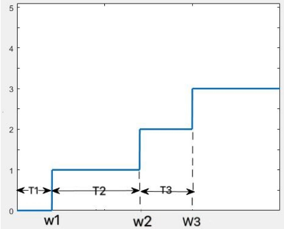

《应用随机过程》张波

# 第二章 随机过程的基本概念

$\bf Def\ (随机过程)$

概率空间 $(\Omega,F,P)$ 上的一族随机变量 $X_T=\{X_t:t\in T\}$ 称为**随机过程（S.P.）**。
1. $T$ 称为**参数集**，以下默认 $T\subset\mathbb{R}$；
2. 以 $I$ 记 $X_T$ 所有可能取值的集合，称为**状态空间**；
3. 任意给定样本点 $e\in\Omega$，函数 $X(e):T\to I$ 称为 $X_T$ 的一条**样本轨道（样本函数）**；
5. 称两个随机过程 $X_T,Y_T$ **随机等价（或互为修正）**，如果 $P(X_t=Y_t)=1,\forall t\in T$；
6. 对任意 $n\geq1,t_1,\dots,t_n\in T$，记 $F_{t_1,\dots,t_n}$ 为 $(X_{t_1},\dots,X_{t_n})$ 的联合分布函数。$\mathbb{F}=\{F_{t_1,\dots,t_n}:n\geq1,t_1,\dots,t_n\in T\}$ 称为**有限维分布函数族**；
    1. （对称性）对 $(1,2,\dots,n)$ 做换序，则 $F_{t_1,\dots,t_n}(x_1,\dots,x_n)$ 不变；
    2. （相容性）$F_{t_1,\dots,t_m}(x_1,\dots,x_m)=F_{t_1,\dots,t_n}(x_1,\dots,x_m,+\infty,\dots,+\infty)$。

$\bf Thm\ (Kolmogorov)$

若分布函数族 $\mathbb{F}=\{F_{t_1,\dots,t_n}:n\geq1,t_1,\dots,t_n\in T\}$ 满足对称性和相容性，则存在概率空间 $(\Omega,F,P)$ 及其上面的随机过程 $X_T$ 使得 $\mathbb{F}_{X_T}=\mathbb{F}$。(证明需要用到测度论)

  

设 $X_T$ 是 $(\Omega,F,P)$ 上的S.P.，

$\bf Def\ (随机过程的数字特征)$

1. 若 $\forall t\in T,E(|X_t|)<+\infty$，则称 $m(t):=E(X_t)$ 为**均值函数**；
2. 若 $\forall t\in T,E(|X_t|^2)<+\infty$，则称 $X_T$ 为**二阶矩过程**；
   1. 称 $D(t):=D(X_t)$ 为**方差函数**；
   2. 称 $R(s,t):=E(X_sX_t)$ 为**相关函数**；
   3. 称 $B(s,t):=\mathrm{cov}(X_s,X_t)$ 为**协方差函数**（复值加共轭）。

$\bf Def\ (随机过程的增量)$

对 $s<t$ ，称 $X_t-X_s$ 为 $X_T$ 在时间区间 $(s,t]$ 上的增量。

1. 若 $X_T$ 在不相交的时间区间上的增量相互独立，则称 $X_T$ 为**独立增量过程**；
2. 若 $X_T$ 的增量的分布只依赖于区间区间的长度 $t-s$，则称 $X_T$ 为**平稳增量过程**；
3. 同时满足以上两条，称为**独立平稳增量过程（可加过程、Levy过程）**。

---

# 第三章 Poisson过程

## 3.1 定义与基本性质

$\bf Def\ (计数过程)$

若 $\forall t\geq0$，$N_t$ 表示在时间区间 $[0,t]$ 内随机事件 $A$ 发生的次数，则称 $\{N_t,t\geq 0\}$ 为**计数过程**。计数过程显然有如下性质；

1. 状态空间 $I=\mathbb{N}$；
2. 样本轨道单调递增；
3. 增量 $N_t-N_s$ 表示 $(s,t]$ 时间内 $A$ 发生的次数。

$\bf Def\ (Poisson过程)$

若计数过程 $\{N_t,t\geq 0\}$ 满足如下条件，称为**Poisson过程**。其中 $\lambda$ 称为单位时间内，事件 $A$ 发生的平均次数（强度，发生速率）。

1. $N_0=0$；
2. $\{N_t,t\geq 0\}$ 为独立增量过程；
3. $\{N_t,t\geq 0\}$ 为平稳增量过程，并且 $N_t-N_s\sim P(\lambda(t-s))$ ，即 $\forall k\geq 0,P(N_t-N_s=k)=e^{-\lambda(t-s)}\frac{(\lambda(t-s))^k}{k!}$。

第三条可以等价地替换为（用归纳法和微分方程）

1. $\{N_t,t\geq 0\}$ 为平稳增量过程，并且 $P(N_{t+h}-N_t=1)=\lambda h+o(h)$， $P(N_{t+h}-N_t\geq 2)=o(h)$。

$\bf Rmk$

关于计数过程以及Poisson过程的所在的概率空间，参看[The understanding of Poisson process](https://math.stackexchange.com/questions/4126837/the-understanding-of-poisson-process/4127200#4127200)

  

$\bf Prop$

设 $\{N_t,t\geq 0\}$ 为参数为 $\lambda$ 的Poisson过程，则

1. 均值函数 $m(t)=\lambda t$；
2. 方差函数 $D(t)=\lambda t$；
3. 相关函数 $R(s,t)=\lambda^2 st+\lambda\min(s,t)$。

> $\it Proof$
>
> (3) 不妨设 $s\leq t$，则 $R(s,t)=E(X_s(X_t-X_s+X_s))=E(X_s)E(X_t-X_s)+E(X_s^2)=E(X_s)E(X_t-X_s)+E(X_s)^2+D(X_s)$

$\bf Prop$

设 $\{N_t^1,t\geq 0\}$ 和 $\{N_t^2,t\geq 0\}$ 是两个独立的Poisson过程，参数分别为 $\lambda_1,\lambda_2$。则 $N_t=N_t^1+N_t^2$ 为参数为 $\lambda_1+\lambda_2$ 的Poisson过程。（按照第二个定义验证即可）

  

## 3.2 到达时刻与时间间隔

如图，以 $W_n$ 记 $A$ 第 $n$ 次发生的时刻，称为第 $n$ 个**到达时刻**；以 $T_n$ 记 $A$ 第 $n-1$ 次发生到第 $n$ 次发生的时间间隔，称为第 $n$ 个**时间间隔**，则
$$
W_n=\sum_{k=1}^nT_k\\[1ex]
T_n=W_n-W_{n-1}
$$

$\bf Prop\ (到达时刻的分布)$

到达时刻服从Gamma分布 $W_n\sim\Gamma(n,\lambda)$，密度函数 $f_{W_n}(t)=\lambda e^{-\lambda t}\frac{(\lambda t)^{n-1}}{(n-1)!}$

$\bf Prop\ (时间间隔的分布)$

时间间隔独立同分布，服从指数分布 $\{T_n\}\ i.i.d.\sim E(\lambda)$

$\bf Rmk$

设 $F(x)$ 是分布函数，$F^{-1}(x)$ 是反函数。生成随机数 $u\sim U(0,1)$，则 $x=F^{-1}(u)$ 就是服从该特定分布的随机数。利用该方法，生成指数分布的简单样本 $\{T_n\}_{n=1}^\infty\ i.i.d.\sim E(\lambda)$，并令 $W_n=\sum_{k=1}^nT_k$ ，即可得到Poisson分布的到达时刻，从而画出样本轨迹。（这实际上是Poisson过程的第三个等价定义，见更新过程）

  

$\bf Lem$

设总体 $X$ 为C.R.V.（连续性随机变量），密度为 $f(x)$，其简单随机样本 $(X_1,\dots,X_n)$ 的顺序统计量 $(X_1^\ast,\dots,X_n^\ast)$ 的联合密度为 $f(x_1,\dots,x_n)=n!\prod_{k=1}^nf(x_i)\cdot\chi_{\{x_1<\dots<x_n\}}$

$\bf Thm\ (到达时刻的条件分布)$

在 $N_t=n$ 的条件下，$(W_1\dots,W_n)$ 与 $n$ 个独立的 $[0,t]$ 上的均匀分布的顺序统计量 $(U_1^\ast,\dots,U_n^\ast)$ 同分布，即 $f(t_1,t_2,\dots,t_n\mid N_t=n)=\frac{n!}{t^n}\cdot\chi_{\{0<t_1<\dots<t_n<t\}}$

  

## 3.3 Poisson过程的推广

在实际场景中，Poisson过程的强度往往不是常数，因此引入如下推广。

$\bf Def\ (非齐次Poisson过程)$

若计数过程 $\{N_t,t\geq 0\}$ 满足如下条件，称为**非齐次Poisson过程**。

1. $N_0=0$ ；
2. $\{N_t,t\geq 0\}$ 为独立增量过程；
3. $P(N_{t+h}-N_t=1)=\lambda(t)h+o(h)$， $P(N_{t+h}-N_t\geq 2)=o(h)$。（不一定具有平稳增量性）

第三条可以等价地替换为（用归纳法和微分方程）

3. $N_t-N_s\sim P(\int_s^t\lambda(u)du)$

$\bf Def\ (复合Poisson过程)$

设 $\{N_t,t\geq 0\}$ 为参数为 $\lambda$ 的Poisson过程， $\{\xi_n\}_{n=1}^\infty\ i.i.d.$ 且与 $\{N_t,t\geq 0\}$ 相互独立。令 $X_t=\sum_{k=1}^{N_t}\xi_k$，称 $\{X_t,t\geq 0\}$ 为**复合Poisson过程**。利用随机个随机变量的和的特征函数，可以求出其增量的分布。

$\bf Def\ (更新过程)$

设 $\{T_n\}_{n=1}^\infty\ i.i.d.$ 非负，令 $W_0=0,W_n=\sum_{k=1}^nT_k$。令 $N_t=\sup\{n:W_n\leq t\}$ 或 $N_t=\sum_{n=1}^\infty\chi_{\{W_n\leq t\}}$，则称 $\{N_t,t\geq 0\}$ 为一个**更新过程**。特别地，若 $\{T_n\}\ i.i.d.\sim E(\lambda)$，可以证明这就是一个Poisson过程。

---

# 第四章 Wiener过程

## 4.1 定义与基本性质

$\bf Def\ (Wiener过程)$

若 $\{W_t,t\geq 0\}$ 是 $(\Omega,F,P)$ 上的S.P.，满足

1. $W_0=0$；
2. $\{W_t,t\geq 0\}$ 为独立增量过程；
3. $\{W_t,t\geq 0\}$ 为平稳增量过程，并且 $W_t-W_s\sim N(0,\sigma^2|t-s|)$ ，

则称 $\{W_t,t\geq 0\}$ 是参数为 $\sigma^2$ 的**Wiener过程（或Brown运动）**。特别地，当 $\sigma=1$，称为标准Brown运动（以后默认）。

  

$\bf Prop$

设 $\{W_t,t\geq 0\}$ 为标准Brown运动，则

1. 均值函数 $m(t)=0$；
2. 方差函数 $D(t)=\sigma^2$；
3. 相关函数 $R(s,t)=\min(s,t)$；
4. 令 $X_t=\sigma W_t$，则 $\{X_t,t\geq 0\}$ 是参数为 $\sigma^2$ 的Wiener过程。

$\bf Prop$

设 $\{W_t,t\geq 0\}$ 为标准Brown运动，对于 $0<t_1<\dots<t_n$，$(W_{t_1},\dots,W_{t_n})$ 的联合密度为 $f_{t_1,\dots,t_n}(x_1,\dots,x_n)=\prod_{i=1}^np(t_i-t_{i-1},x_i-x_{i-1})$，其中 $p(\sigma,x)$ 是均值和方差分别为 $0,\sigma^2$ 的正态分布密度函数，$t_0=0,x_0=0$。

> $\it Proof$
>
> 联合分布函数 $F(x_1,\dots,x_n)=P(W_{t_1}<x_1,\dots,W_{t_n}<x_n)=P(W_{t_1}-W_{t_0}<x_1,\dots,W_{t_n}-W_{t_{n-1}}<x_n-x_{n-1})=\prod_{i=1}^nP(W_{t_i}-W_{t_{i-1}}<x_i-x_{i-1})$ 。

  

$\bf Lem$

设 $T\subset\mathbb{R}$，$X_T$ 是 $(\Omega,F,P)$ 上的S.P.，若存在 $a>1,c>0,p>0$ 使得 $\forall s,t\in T,E(|X_t-X_s|^p)\leq c|t-s|^a$，则 $X_T$ 存在有连续轨道的修正（随机等价的S.P.）。

$\bf Prop$

Weiner过程有连续轨道的修正，因为 $E|W_t-W_s|^4=3|t-s|^2$ （正态分布的四阶矩）。因此以后默认Weiner过程的轨道连续。

  

$\bf Prop$

设 $\{W_t,t\geq 0\}$ 为标准Brown运动，则以下S.P.都是标准Brown运动。

1. 对 $s>0$，令 $X_t=W_{s+t}-W_s$；
2. 对 $c>0$，令 $X_t=\frac{1}{c}W(c^2t)$；
3. 令 $X_0=0$，$X_t=tW(1/t)$。
